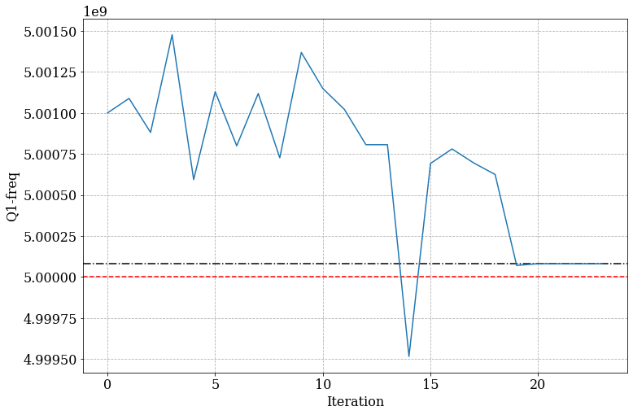

Model Learning
=====================================================

In this notebook, we will use a dataset from a simulated experiment,
more specifically, the ``Simulated_calibration.ipynb`` example notebook
and perform Model Learning on a simple 1 qubit model.

Imports
~~~~~~~

.. code:: python

    import pickle
    from pprint import pprint
    import copy
    import numpy as np
    import os
    import ast
    import pandas as pd
    
    from c3.model import Model as Mdl
    from c3.c3objs import Quantity as Qty
    from c3.parametermap import ParameterMap as PMap
    from c3.experiment import Experiment as Exp
    from c3.generator.generator import Generator as Gnr
    import c3.signal.gates as gates
    import c3.libraries.chip as chip
    import c3.generator.devices as devices
    import c3.libraries.hamiltonians as hamiltonians
    import c3.signal.pulse as pulse
    import c3.libraries.envelopes as envelopes
    import c3.libraries.tasks as tasks
    from c3.optimizers.modellearning import ModelLearning

The Dataset
-----------

We first take a look below at the dataset and its properties. To explore
more details about how the dataset is generated, please refer to the
``Simulated_calibration.ipynb`` example notebook.

.. code:: python

    DATAFILE_PATH = "data/small_dataset.pkl"

.. code:: python

    with open(DATAFILE_PATH, "rb+") as file:
        data = pickle.load(file)

.. code:: python

    data.keys()

.. parsed-literal::

    dict_keys(['seqs_grouped_by_param_set', 'opt_map'])

Since this dataset was obtained from an ORBIT
(`arXiv:1403.0035 <https://arxiv.org/abs/1403.0035>`__) calibration
experiment, we have the ``opt_map`` which will tell us about the gateset
parameters being optimized.

.. code:: python

    data["opt_map"]

.. parsed-literal::

    [['rx90p[0]-d1-gauss-amp',
      'ry90p[0]-d1-gauss-amp',
      'rx90m[0]-d1-gauss-amp',
      'ry90m[0]-d1-gauss-amp'],
     ['rx90p[0]-d1-gauss-delta',
      'ry90p[0]-d1-gauss-delta',
      'rx90m[0]-d1-gauss-delta',
      'ry90m[0]-d1-gauss-delta'],
     ['rx90p[0]-d1-gauss-freq_offset',
      'ry90p[0]-d1-gauss-freq_offset',
      'rx90m[0]-d1-gauss-freq_offset',
      'ry90m[0]-d1-gauss-freq_offset'],
     ['id[0]-d1-carrier-framechange']]

This ``opt_map`` implies the calibration experiment focussed on
optimizing the amplitude, delta and frequency offset of the gaussian
pulse, along with the framechange angle

Now onto the actual measurement data from the experiment runs

.. code:: python

    seqs_data = data["seqs_grouped_by_param_set"]

**How many experiment runs do we have?**

.. code:: python

    len(seqs_data)

.. parsed-literal::

    41

**What does the data from each experiment look like?**

We take a look at the first data point

.. code:: python

    example_data_point = seqs_data[0]

.. code:: python

    example_data_point.keys()

.. parsed-literal::

    dict_keys(['params', 'seqs', 'results', 'results_std', 'shots'])

These ``keys`` are useful in understanding the structure of the dataset.
We look at them one by one.

.. code:: python

    example_data_point["params"]

.. parsed-literal::

    [450.000 mV, -1.000 , -50.500 MHz 2pi, 4.084 rad]

These are the parameters for our parameterised gateset, for the first
experiment run. They correspond to the optimization parameters we
previously discussed.

The ``seqs`` key stores the sequence of gates that make up this ORBIT
calibration experiment. Each ORBIT sequence consists of a set of gates,
followed by a measurement operation. This is then repeated for some
``n`` number of shots (eg, ``1000`` in this case) and we only store the
averaged result along with the standard deviation of these readout
shots. Each experiment in turn consists of a number of these ORBIT
sequences. The terms *sequence*, *set* and *experiment* are used
somewhat loosely here, so we show below what these look like.

**A single ORBIT sequence**

.. code:: python

    example_data_point["seqs"][0]

.. parsed-literal::

    ['ry90p[0]',
     'rx90p[0]',
     'rx90p[0]',
     'rx90m[0]',
     'ry90p[0]',
     'ry90p[0]',
     'rx90p[0]',
     'ry90p[0]',
     'rx90p[0]',
     'rx90p[0]',
     'ry90p[0]',
     'rx90m[0]',
     'rx90p[0]',
     'rx90p[0]',
     'ry90p[0]',
     'ry90p[0]',
     'rx90p[0]',
     'ry90p[0]',
     'ry90m[0]',
     'rx90p[0]',
     'rx90p[0]',
     'ry90m[0]',
     'rx90p[0]',
     'rx90p[0]',
     'rx90p[0]',
     'rx90p[0]']

**Total number of ORBIT sequences in an experiment**

.. code:: python

    len(example_data_point["seqs"])

.. parsed-literal::

    20

**Total number of Measurement results**

.. code:: python

    len(example_data_point["results"])

.. parsed-literal::

    20

**The measurement results and the standard deviation look like this**

.. code:: python

    example_results = [
        (example_data_point["results"][i], example_data_point["results_std"][i])
        for i in range(len(example_data_point["results"]))
    ]

.. code:: python

    pprint(example_results)

.. parsed-literal::

    [([0.745], [0.013783141876945182]),
     ([0.213], [0.012947239087929134]),
     ([0.137], [0.0108734079294396]),
     ([0.224], [0.013184233007649706]),
     ([0.434], [0.015673034167001616]),
     ([0.105], [0.009694070352540258]),
     ([0.214], [0.012969348480166613]),
     ([0.112], [0.009972762907038352]),
     ([0.318], [0.014726710426975877]),
     ([0.122], [0.010349685985574633]),
     ([0.348], [0.015063067416698366]),
     ([0.122], [0.010349685985574633]),
     ([0.558], [0.01570464899321217]),
     ([0.186], [0.01230463327369004]),
     ([0.096], [0.009315793041926168]),
     ([0.368], [0.015250442616527561]),
     ([0.146], [0.011166198995181842]),
     ([0.121], [0.010313049985334118]),
     ([0.748], [0.013729384545565035]),
     ([0.692], [0.01459917805905524])]

The Model for Model Learning
----------------------------

An initial model needs to be provided, which we refine by fitting to our
calibration data. We do this below. If you want to learn more about what
the various components of the model mean, please refer back to the
``two_qubits.ipynb`` notebook or the documentation.

Define Constants
~~~~~~~~~~~~~~~~

.. code:: python

    lindblad = False
    dressed = True
    qubit_lvls = 3
    freq = 5.001e9
    anhar = -210.001e6
    init_temp = 0
    qubit_temp = 0
    t_final = 7e-9  # Time for single qubit gates
    sim_res = 100e9
    awg_res = 2e9
    sideband = 50e6
    lo_freq = 5e9 + sideband

Model
~~~~~

.. code:: python

    q1 = chip.Qubit(
        name="Q1",
        desc="Qubit 1",
        freq=Qty(
            value=freq,
            min_val=4.995e9,
            max_val=5.005e9,
            unit="Hz 2pi",
        ),
        anhar=Qty(
            value=anhar,
            min_val=-250e6,
            max_val=-150e6,
            unit="Hz 2pi",
        ),
        hilbert_dim=qubit_lvls,
        temp=Qty(value=qubit_temp, min_val=0.0, max_val=0.12, unit="K"),
    )
    
    drive = chip.Drive(
        name="d1",
        desc="Drive 1",
        comment="Drive line 1 on qubit 1",
        connected=["Q1"],
        hamiltonian_func=hamiltonians.x_drive,
    )
    phys_components = [q1]
    line_components = [drive]
    
    init_ground = tasks.InitialiseGround(
        init_temp=Qty(value=init_temp, min_val=-0.001, max_val=0.22, unit="K")
    )
    task_list = [init_ground]
    model = Mdl(phys_components, line_components, task_list)
    model.set_lindbladian(lindblad)
    model.set_dressed(dressed)

Generator
~~~~~~~~~

.. code:: python

    generator = Gnr(
        devices={
            "LO": devices.LO(name="lo", resolution=sim_res, outputs=1),
            "AWG": devices.AWG(name="awg", resolution=awg_res, outputs=1),
            "DigitalToAnalog": devices.DigitalToAnalog(
                name="dac", resolution=sim_res, inputs=1, outputs=1
            ),
            "Response": devices.Response(
                name="resp",
                rise_time=Qty(value=0.3e-9, min_val=0.05e-9, max_val=0.6e-9, unit="s"),
                resolution=sim_res,
                inputs=1,
                outputs=1,
            ),
            "Mixer": devices.Mixer(name="mixer", inputs=2, outputs=1),
            "VoltsToHertz": devices.VoltsToHertz(
                name="v_to_hz",
                V_to_Hz=Qty(value=1e9, min_val=0.9e9, max_val=1.1e9, unit="Hz/V"),
                inputs=1,
                outputs=1,
            ),
        },
        chains={
            "d1": {
                "LO": [],
                "AWG": [],
                "DigitalToAnalog": ["AWG"],
                "Response": ["DigitalToAnalog"],
                "Mixer": ["LO", "Response"],
                "VoltsToHertz": ["Mixer"]
            }
        },
    )
    generator.devices["AWG"].enable_drag_2()

Gateset
~~~~~~~

.. code:: python

    gauss_params_single = {
        "amp": Qty(value=0.45, min_val=0.4, max_val=0.6, unit="V"),
        "t_final": Qty(
            value=t_final, min_val=0.5 * t_final, max_val=1.5 * t_final, unit="s"
        ),
        "sigma": Qty(value=t_final / 4, min_val=t_final / 8, max_val=t_final / 2, unit="s"),
        "xy_angle": Qty(value=0.0, min_val=-0.5 * np.pi, max_val=2.5 * np.pi, unit="rad"),
        "freq_offset": Qty(
            value=-sideband - 0.5e6,
            min_val=-60 * 1e6,
            max_val=-40 * 1e6,
            unit="Hz 2pi",
        ),
        "delta": Qty(value=-1, min_val=-5, max_val=3, unit=""),
    }
    
    gauss_env_single = pulse.Envelope(
        name="gauss",
        desc="Gaussian comp for single-qubit gates",
        params=gauss_params_single,
        shape=envelopes.gaussian_nonorm,
    )
    nodrive_env = pulse.Envelope(
        name="no_drive",
        params={
            "t_final": Qty(
                value=t_final, min_val=0.5 * t_final, max_val=1.5 * t_final, unit="s"
            )
        },
        shape=envelopes.no_drive,
    )
    carrier_parameters = {
        "freq": Qty(
            value=lo_freq,
            min_val=4.5e9,
            max_val=6e9,
            unit="Hz 2pi",
        ),
        "framechange": Qty(value=0.0, min_val=-np.pi, max_val=3 * np.pi, unit="rad"),
    }
    carr = pulse.Carrier(
        name="carrier",
        desc="Frequency of the local oscillator",
        params=carrier_parameters,
    )
    
    rx90p = gates.Instruction(
        name="rx90p", t_start=0.0, t_end=t_final, channels=["d1"], targets=[0]
    )
    QId = gates.Instruction(
        name="id", t_start=0.0, t_end=t_final, channels=["d1"], targets=[0]
    )
    
    rx90p.add_component(gauss_env_single, "d1")
    rx90p.add_component(carr, "d1")
    QId.add_component(nodrive_env, "d1")
    QId.add_component(copy.deepcopy(carr), "d1")
    QId.comps["d1"]["carrier"].params["framechange"].set_value(
        (-sideband * t_final) % (2 * np.pi)
    )
    ry90p = copy.deepcopy(rx90p)
    ry90p.name = "ry90p"
    rx90m = copy.deepcopy(rx90p)
    rx90m.name = "rx90m"
    ry90m = copy.deepcopy(rx90p)
    ry90m.name = "ry90m"
    ry90p.comps["d1"]["gauss"].params["xy_angle"].set_value(0.5 * np.pi)
    rx90m.comps["d1"]["gauss"].params["xy_angle"].set_value(np.pi)
    ry90m.comps["d1"]["gauss"].params["xy_angle"].set_value(1.5 * np.pi)

Experiment
~~~~~~~~~~

.. code:: python

    parameter_map = PMap(
        instructions=[QId, rx90p, ry90p, rx90m, ry90m], model=model, generator=generator
    )
    
    exp = Exp(pmap=parameter_map)

.. code:: python

    exp_opt_map = [[('Q1', 'anhar')], [('Q1', 'freq')]]
    exp.pmap.set_opt_map(exp_opt_map)

Optimizer
---------

.. code:: python

    datafiles = {"orbit": DATAFILE_PATH} # path to the dataset
    run_name = "simple_model_learning" # name of the optimization run
    dir_path = "ml_logs" # path to save the learning logs
    algorithm = "cma_pre_lbfgs" # algorithm for learning
    # this first does a grad-free CMA-ES and then a gradient based LBFGS
    options = {
        "cmaes": {
            "popsize": 12,
            "init_point": "True",
            "stop_at_convergence": 10,
            "ftarget": 4,
            "spread": 0.05,
            "stop_at_sigma": 0.01,
        },
        "lbfgs": {"maxfun": 50, "disp": 0},
    } # options for the algorithms
    sampling = "high_std" # how data points are chosen from the total dataset
    batch_sizes = {"orbit": 2} # how many data points are chosen for learning
    state_labels = {
        "orbit": [
            [
                1,
            ],
            [
                2,
            ],
        ]
    } # the excited states of the qubit model, in this case it is 3-level

.. code:: python

    opt = ModelLearning(
        datafiles=datafiles,
        run_name=run_name,
        dir_path=dir_path,
        algorithm=algorithm,
        options=options,
        sampling=sampling,
        batch_sizes=batch_sizes,
        state_labels=state_labels,
        pmap=exp.pmap,
    )
    
    opt.set_exp(exp)

Model Learning
--------------

We are now ready to learn from the data and improve our model

.. code:: python

    opt.run()

.. parsed-literal::

    C3:STATUS:Saving as: /home/users/anurag/c3/examples/ml_logs/simple_model_learning/2021_06_30_T_08_59_07/model_learn.log
    (6_w,12)-aCMA-ES (mu_w=3.7,w_1=40%) in dimension 2 (seed=125441, Wed Jun 30 08:59:07 2021)
    C3:STATUS:Adding initial point to CMA sample.
    Iterat #Fevals   function value  axis ratio  sigma  min&max std  t[m:s]
        1     12 3.767977884544180e+00 1.0e+00 4.89e-02  4e-02  5e-02 0:31.1
    termination on ftarget=4
    final/bestever f-value = 3.767978e+00 3.767978e+00
    incumbent solution: [-0.22224933524057258, 0.17615005514516885]
    std deviation: [0.0428319357676611, 0.04699011947850928]
    C3:STATUS:Saving as: /home/users/anurag/c3/examples/ml_logs/simple_model_learning/2021_06_30_T_08_59_07/confirm.log

Result of Model Learning
~~~~~~~~~~~~~~~~~~~~~~~~

.. code:: python

    opt.current_best_goal

.. parsed-literal::

    -0.031570491979011794

.. code:: python

    print(opt.pmap.str_parameters(opt.pmap.opt_map))

.. parsed-literal::

    Q1-anhar                              : -210.057 MHz 2pi 
    Q1-freq                               : 5.000 GHz 2pi 
    

Visualisation & Analysis of Results
-----------------------------------

The Model Learning logs provide a useful way to visualise the learning
process and also understand what’s going wrong (or right). We now
process these logs to read some data points and also plot some
visualisations of the Model Learning process

Open, Clean-up and Convert Logfiles
~~~~~~~~~~~~~~~~~~~~~~~~~~~~~~~~~~~

.. code:: python

    LOGDIR = opt.logdir

.. code:: python

    logfile = os.path.join(LOGDIR, "model_learn.log")
    with open(logfile, "r") as f:
        log = f.readlines()

.. code:: python

    params_names = [
        item for sublist in (ast.literal_eval(log[3].strip("\n"))) for item in sublist
    ]
    print(params_names)

.. parsed-literal::

    ['Q1-anhar', 'Q1-freq']

.. code:: python

    data_list_dict = list()
    for line in log[9:]:
        if line[0] == "{":
            temp_dict = ast.literal_eval(line.strip("\n"))
            for index, param_name in enumerate(params_names):
                temp_dict[param_name] = temp_dict["params"][index]
            temp_dict.pop("params")
            data_list_dict.append(temp_dict)

.. code:: python

    data_df = pd.DataFrame(data_list_dict)

Summary of Logs
~~~~~~~~~~~~~~~

.. code:: python

    data_df.describe()

.. raw:: html

    

    
    <table border="1" class="dataframe">
      <thead>
        <tr style="text-align: right;">
          <th></th>
          <th>goal</th>
          <th>Q1-anhar</th>
          <th>Q1-freq</th>
        </tr>
      </thead>
      <tbody>
        <tr>
          <th>count</th>
          <td>24.000000</td>
          <td>2.400000e+01</td>
          <td>2.400000e+01</td>
        </tr>
        <tr>
          <th>mean</th>
          <td>6.846330</td>
          <td>-2.084322e+08</td>
          <td>5.000695e+09</td>
        </tr>
        <tr>
          <th>std</th>
          <td>7.975091</td>
          <td>9.620771e+06</td>
          <td>4.833397e+05</td>
        </tr>
        <tr>
          <th>min</th>
          <td>-0.031570</td>
          <td>-2.141120e+08</td>
          <td>4.999516e+09</td>
        </tr>
        <tr>
          <th>25%</th>
          <td>1.771696</td>
          <td>-2.113225e+08</td>
          <td>5.000466e+09</td>
        </tr>
        <tr>
          <th>50%</th>
          <td>5.289741</td>
          <td>-2.100573e+08</td>
          <td>5.000790e+09</td>
        </tr>
        <tr>
          <th>75%</th>
          <td>9.288638</td>
          <td>-2.092798e+08</td>
          <td>5.001038e+09</td>
        </tr>
        <tr>
          <th>max</th>
          <td>37.919470</td>
          <td>-1.639775e+08</td>
          <td>5.001476e+09</td>
        </tr>
      </tbody>
    </table>
    

**Best Point**

.. code:: python

    best_point_file = os.path.join(LOGDIR, 'best_point_model_learn.log')

.. code:: python

    with open(best_point_file, "r") as f:
        best_point = f.read()
        best_point_log_dict = ast.literal_eval(best_point)
    
    best_point_dict = dict(zip(params_names, best_point_log_dict["optim_status"]["params"]))
    best_point_dict["goal"] = best_point_log_dict["optim_status"]["goal"]
    print(best_point_dict)

.. parsed-literal::

    {'Q1-anhar': -210057285.60876995, 'Q1-freq': 5000081146.481342, 'goal': -0.031570491979011794}

Plotting
~~~~~~~~

We use ``matplotlib`` to produce the plots below. Please make sure you
have the same installed in your python environment.

.. code:: python

    !pip install -q matplotlib

.. parsed-literal::

    WARNING: You are using pip version 21.1.2; however, version 21.1.3 is available.
    You should consider upgrading via the '/home/users/anurag/.conda/envs/c3-qopt/bin/python -m pip install --upgrade pip' command.

.. code:: python

    from matplotlib.ticker import MaxNLocator
    from  matplotlib import rcParams
    from matplotlib import cycler
    import matplotlib as mpl
    import matplotlib.pyplot as plt 

.. code:: python

    rcParams["axes.grid"] = True
    rcParams["grid.linestyle"] = "--"
    
    # enable usetex by setting it to True if LaTeX is installed
    rcParams["text.usetex"] = False
    rcParams["font.size"] = 16
    rcParams["font.family"] = "serif"

**In the plots below, the blue line shows the progress of the parameter
optimization while the black and the red lines indicate the converged
and true value respectively**

Qubit Anharmonicity
~~~~~~~~~~~~~~~~~~~

.. code:: python

    plot_item = "Q1-anhar"
    true_value = -210e6
    
    fig = plt.figure(figsize=(12, 8))
    ax = fig.add_subplot(111)
    ax.set_xlabel("Iteration")
    ax.set_ylabel(plot_item)
    ax.axhline(y=true_value, color="red", linestyle="--")
    ax.axhline(y=best_point_dict[plot_item], color="black", linestyle="-.")
    ax.plot(data_df[plot_item])

.. parsed-literal::

    [<matplotlib.lines.Line2D at 0x7fc3c5ab5f70>]

Qubit Frequency
~~~~~~~~~~~~~~~

.. code:: python

    plot_item = "Q1-freq"
    true_value = 5e9
    
    fig = plt.figure(figsize=(12, 8))
    ax = fig.add_subplot(111)
    ax.set_xlabel("Iteration")
    ax.set_ylabel(plot_item)
    ax.axhline(y=true_value, color="red", linestyle="--")
    ax.axhline(y=best_point_dict[plot_item], color="black", linestyle="-.")
    ax.plot(data_df[plot_item])

.. parsed-literal::

    [<matplotlib.lines.Line2D at 0x7fc3c59aa340>]

Goal Function
~~~~~~~~~~~~~

.. code:: python

    plot_item = "goal"
    
    fig = plt.figure(figsize=(12, 8))
    ax = fig.add_subplot(111)
    ax.set_xlabel("Iteration")
    ax.axhline(y=best_point_dict[plot_item], color="black", linestyle="-.")
    ax.set_ylabel(plot_item)
    
    ax.plot(data_df[plot_item])

.. parsed-literal::

    [<matplotlib.lines.Line2D at 0x7fc3c591d910>]

Sensitivity Analysis
====================

Another interesting study to understand if our dataset is indeed helpful
in improving certain model parameters is to perform a Sensitivity
Analysis. The purpose of this exercise is to scan the Model Parameters
of interest (eg, qubit frequency or anharmonicity) across a range of
values and notice a prominent dip in the Model Learning Goal Function
around the best-fit values

.. code:: python

    run_name = "Sensitivity"
    dir_path = "sensi_logs"
    algorithm = "sweep"
    options = {"points": 20, "init_point": [-210e6, 5e9]}
    sweep_bounds = [
        [-215e6, -205e6],
        [4.9985e9, 5.0015e9],
    ]

.. code:: python

    sense_opt = Sensitivity(
        datafiles=datafiles,
        run_name=run_name,
        dir_path=dir_path,
        algorithm=algorithm,
        options=options,
        sampling=sampling,
        batch_sizes=batch_sizes,
        state_labels=state_labels,
        pmap=exp.pmap,
        sweep_bounds=sweep_bounds,
        sweep_map=exp_opt_map,
    )
    
    sense_opt.set_exp(exp)

.. code:: python

    sense_opt.run()

.. parsed-literal::

    C3:STATUS:Sweeping [['Q1-anhar']]: [-215000000.0, -205000000.0]
    C3:STATUS:Saving as: /home/users/anurag/c3/examples/sensi_logs/Sensitivity/2021_07_05_T_20_56_46/sensitivity.log
    C3:STATUS:Sweeping [['Q1-freq']]: [4998500000.0, 5001500000.0]
    C3:STATUS:Saving as: /home/users/anurag/c3/examples/sensi_logs/Sensitivity/2021_07_05_T_20_57_38/sensitivity.log

Anharmonicity
-------------

.. code:: python

    LOGDIR = sense_opt.logdir_list[0]

.. code:: python

    logfile = os.path.join(LOGDIR, "sensitivity.log")
    with open(logfile, "r") as f:
        log = f.readlines()

.. code:: python

    data_list_dict = list()
    for line in log[9:]:
        if line[0] == "{":
            temp_dict = ast.literal_eval(line.strip("\n"))
            param = temp_dict["params"][0]
            data_list_dict.append({"param": param, "goal": temp_dict["goal"]})

.. code:: python

    data_df = pd.DataFrame(data_list_dict)

.. code:: python

    fig = plt.figure(figsize=(12, 8))
    ax = fig.add_subplot(111)
    ax.set_xlabel("Q1-Anharmonicity [Hz]")
    ax.set_ylabel("Goal Function")
    ax.axvline(x=best_point_dict["Q1-anhar"], color="black", linestyle="-.")
    ax.scatter(data_df["param"], data_df["goal"])

.. parsed-literal::

    <matplotlib.collections.PathCollection at 0x7f917a341d30>

Frequency
---------

.. code:: python

    LOGDIR = sense_opt.logdir_list[1]

.. code:: python

    logfile = os.path.join(LOGDIR, "sensitivity.log")
    with open(logfile, "r") as f:
        log = f.readlines()

.. code:: python

    data_list_dict = list()
    for line in log[9:]:
        if line[0] == "{":
            temp_dict = ast.literal_eval(line.strip("\n"))
            param = temp_dict["params"][0]
            data_list_dict.append({"param": param, "goal": temp_dict["goal"]})

.. code:: python

    data_df = pd.DataFrame(data_list_dict)

.. code:: python

    fig = plt.figure(figsize=(12, 8))
    ax = fig.add_subplot(111)
    ax.set_xlabel("Q1-Frequency [Hz]")
    ax.set_ylabel("Goal Function")
    ax.axvline(x=best_point_dict["Q1-freq"], color="black", linestyle="-.")
    ax.scatter(data_df["param"], data_df["goal"])

.. parsed-literal::

    <matplotlib.collections.PathCollection at 0x7f917a203370>

