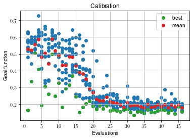

Simulated calibration with :math:`C^2`
======================================

Calibration of control pulses is the process of fine-tuning parameters
in a feedback-loop with the experiment. We will simulate this process
here by constructing a black-box simulation and interacting with it
exactly like an experiment.

We have manange imports and creation of the black-box the same way as in
the previous example in a helper ``single_qubit_blackbox_exp.py``.

.. code-block:: python

    from single_qubit_blackbox_exp import create_experiment
    
    blackbox = create_experiment()

This blackbox is constructed the same way as in the C1 example. The
difference will be in how we interact with it. First, we decide on what
experiment we want to perform and need to specify it as a python
function. A general, minimal example would be

``def exp_communication(params):     # Send parameters to experiment controller     # and recieve a measurement result.     return measurement_result``

Again, ``params`` is a linear vector of bare numbers. The measurement
result can be a single number or a set of results. It can also include
additional information about statistics, like averaging, standard
deviation, etc.

ORBIT - Single-length randomized benchmarking
~~~~~~~~~~~~~~~~~~~~~~~~~~~~~~~~~~~~~~~~~~~~~

The following defines an `ORBIT <https://arxiv.org/abs/1403.0035>`__
procedure. In short, we define sequences of gates that result in an
identity gate if our individual gates are perfect. Any deviation from
identity gives us a measure of the imperfections in our gates. Our
helper ``qt_utils`` provides these sequences.

.. code-block:: python

    from c3.utils import qt_utils

.. code-block:: python

    qt_utils.single_length_RB(
                RB_number=1, RB_length=5,
        )

.. parsed-literal::

    [['Id',
      'Id',
      'Id',
      'Id',
      'Y90m',
      'Id',
      'Id',
      'Id',
      'X90p',
      'Y90m',
      'X90m',
      'Id',
      'Y90m',
      'X90m',
      'Id',
      'Id',
      'X90p',
      'X90p',
      'Y90p',
      'Y90p']]

The desired number of 5 gates is selected from a specific set (the
Clifford group) and has to be decomposed into the available gate-set.
Here, this means 4 gates per Clifford, hence a sequence of 20 gates.

Communication with the experiment
~~~~~~~~~~~~~~~~~~~~~~~~~~~~~~~~~

Some of the following code is specific to the fact that this a
*simulated* calibration.

.. code-block:: python

    import itertools
    import numpy as np
    import tensorflow as tf
    
    def ORBIT(params, exp, opt_map, qubit_labels, logdir):
        
        ### ORBIT meta-parameters ###
        RB_length = 60 # How long each sequence is
        RB_number = 40  # How many sequences
        shots = 1000    # How many averages per readout
    
        ################################
        ### Simulation specific part ###
        ################################
        
        do_noise = False  # Whether to add artificial noise to the results
        
        qubit_label = list(qubit_labels.keys())[0]
        state_labels = qubit_labels[qubit_label]
        state_label = [tuple(l) for l in state_labels]
        
        # Creating the RB sequences #
        seqs = qt_utils.single_length_RB(
                RB_number=RB_number, RB_length=RB_length
        )
    
        # Transmitting the parameters to the experiment #
        exp.gateset.set_parameters(params, opt_map, scaled=False)
        exp.opt_gates = list(
            set(itertools.chain.from_iterable(seqs))
        )
        
        # Simulating the gates #
        U_dict = exp.get_gates()
        
        # Running the RB sequences and read-out the results #
        pops = exp.evaluate(seqs)
        pop1s = exp.process(pops, labels=state_label)
        
        results = []
        results_std = []
        shots_nums = []
    
        # Collecting results and statistics, add noise #
        if do_noise:
            for p1 in pop1s:
                draws = tf.keras.backend.random_binomial(
                    [shots],
                    p=p1[0],
                    dtype=tf.float64,
                )
                results.append([np.mean(draws)])
                results_std.append([np.std(draws)/np.sqrt(shots)])
                shots_nums.append([shots])
        else:
            for p1 in pop1s:
                results.append(p1.numpy())
                results_std.append([0])
                shots_nums.append([shots])
        
        #######################################
        ### End of Simulation specific part ###
        #######################################
        
        goal = np.mean(results)
        return goal, results, results_std, seqs, shots_nums

Optimization
~~~~~~~~~~~~

We first import algorithms and the correct optimizer object.

.. code-block:: python

    import copy
    
    from c3.experiment import Experiment as Exp
    from c3.c3objs import Quantity as Qty
    from c3.libraries import algorithms, envelopes
    from c3.signal import gates, pulse
    from c3.optimizers.c2 import C2

Next, we define the parameters we whish to calibrate. See how these gate
instructions are defined in the experiment setup example or in
``single_qubit_blackbox_exp.py``. Our gate-set is made up of 4 gates,
rotations of 90 degrees around the :math:`x` and :math:`y`-axis in
positive and negative direction. While it is possible to optimize each
parameters of each gate individually, in this example all four gates
share parameters. They only differ in the phase :math:`\phi_{xy}` that
is set in the definitions.

.. code-block:: python

    gateset_opt_map =   [
        [
          ("X90p", "d1", "gauss", "amp"),
          ("Y90p", "d1", "gauss", "amp"),
          ("X90m", "d1", "gauss", "amp"),
          ("Y90m", "d1", "gauss", "amp")
        ],
        [
          ("X90p", "d1", "gauss", "delta"),
          ("Y90p", "d1", "gauss", "delta"),
          ("X90m", "d1", "gauss", "delta"),
          ("Y90m", "d1", "gauss", "delta")
        ],
        [
          ("X90p", "d1", "gauss", "freq_offset"),
          ("Y90p", "d1", "gauss", "freq_offset"),
          ("X90m", "d1", "gauss", "freq_offset"),
          ("Y90m", "d1", "gauss", "freq_offset")
        ],
        [
          ("Id", "d1", "carrier", "framechange")
        ]
      ]

Representation of the experiment within :math:`C^3`
~~~~~~~~~~~~~~~~~~~~~~~~~~~~~~~~~~~~~~~~~~~~~~~~~~~

At this point we have to make sure that the gates (“X90p”, etc.) and
drive line (“d1”) are compatible to the experiment controller operating
the blackbox. We mirror the blackbox by creating an experiment in the
:math:`C^3` context:

.. code-block:: python

    t_final = 7e-9   # Time for single qubit gates
    sideband = 50e6 * 2 * np.pi
    lo_freq = 5e9 * 2 * np.pi + sideband
    
     # ### MAKE GATESET
    gateset = gates.GateSet()
    gauss_params_single = {
        'amp': Qty(
            value=0.45,
            min=0.4,
            max=0.6,
            unit="V"
        ),
        't_final': Qty(
            value=t_final,
            min=0.5 * t_final,
            max=1.5 * t_final,
            unit="s"
        ),
        'sigma': Qty(
            value=t_final / 4,
            min=t_final / 8,
            max=t_final / 2,
            unit="s"
        ),
        'xy_angle': Qty(
            value=0.0,
            min=-0.5 * np.pi,
            max=2.5 * np.pi,
            unit='rad'
        ),
        'freq_offset': Qty(
            value=-sideband - 0.5e6 * 2 * np.pi,
            min=-53 * 1e6 * 2 * np.pi,
            max=-47 * 1e6 * 2 * np.pi,
            unit='Hz 2pi'
        ),
        'delta': Qty(
            value=-1,
            min=-5,
            max=3,
            unit=""
        )
    }
    
    gauss_env_single = pulse.Envelope(
        name="gauss",
        desc="Gaussian comp for single-qubit gates",
        params=gauss_params_single,
        shape=envelopes.gaussian_nonorm
    )
    nodrive_env = pulse.Envelope(
        name="no_drive",
        params={
            't_final': Qty(
                value=t_final,
                min=0.5 * t_final,
                max=1.5 * t_final,
                unit="s"
            )
        },
        shape=envelopes.no_drive
    )
    carrier_parameters = {
        'freq': Qty(
            value=lo_freq,
            min=4.5e9 * 2 * np.pi,
            max=6e9 * 2 * np.pi,
            unit='Hz 2pi'
        ),
        'framechange': Qty(
            value=0.0,
            min= -np.pi,
            max= 3 * np.pi,
            unit='rad'
        )
    }
    carr = pulse.Carrier(
        name="carrier",
        desc="Frequency of the local oscillator",
        params=carrier_parameters
    )
    
    X90p = gates.Instruction(
        name="X90p",
        t_start=0.0,
        t_end=t_final,
        channels=["d1"]
    )
    QId = gates.Instruction(
        name="Id",
        t_start=0.0,
        t_end=t_final,
        channels=["d1"]
    )
    
    X90p.add_component(gauss_env_single, "d1")
    X90p.add_component(carr, "d1")
    QId.add_component(nodrive_env, "d1")
    QId.add_component(copy.deepcopy(carr), "d1")
    QId.comps['d1']['carrier'].params['framechange'].set_value(
        (-sideband * t_final) % (2*np.pi)
    )
    Y90p = copy.deepcopy(X90p)
    Y90p.name = "Y90p"
    X90m = copy.deepcopy(X90p)
    X90m.name = "X90m"
    Y90m = copy.deepcopy(X90p)
    Y90m.name = "Y90m"
    Y90p.comps['d1']['gauss'].params['xy_angle'].set_value(0.5 * np.pi)
    X90m.comps['d1']['gauss'].params['xy_angle'].set_value(np.pi)
    Y90m.comps['d1']['gauss'].params['xy_angle'].set_value(1.5 * np.pi)
    
    for gate in [QId, X90p, Y90p, X90m, Y90m]:
        gateset.add_instruction(gate)
    
    # ### MAKE EXPERIMENT
    exp = Exp(gateset=gateset)

As defined above, we have 16 parameters where 4 share their numerical
value. This leaves 4 values to optimize.

.. code-block:: python

    print(exp.gateset.print_parameters(gateset_opt_map))

.. parsed-literal::

    Y90m-d1-gauss-amp                     : 450.000 mV 
    Y90m-d1-gauss-delta                   : -1.000  
    Y90m-d1-gauss-freq_offset             : -50.500 MHz 2pi 
    Id-d1-carrier-framechange             : 4.084 rad 
    

It is important to note that in this example, we are transmitting only
these four parameters to the experiment. We don’t know how the blackbox
will implement the pulse shapes and care has to be taken that the
parameters are understood on the other end. Optionally, we could
specifiy a virtual AWG within :math:`C^3` and transmit pixilated pulse
shapes directly to the physiscal AWG.

Algorithms
~~~~~~~~~~

As an optimization algoritm, we choose
`CMA-Es <https://en.wikipedia.org/wiki/CMA-ES>`__ and set up some
options specific to this algorithm.

.. code-block:: python

    alg_options = {
        "popsize" : 10,
        "maxfevals" : 450,
        "init_point" : "True",
        "tolfun" : 0.01,
        "spread" : 0.1
      }

We define the subspace as both excited states :math:`\{|1>,|2>\}`,
assuming read-out can distinguish between 0, 1 and 2.

.. code-block:: python

    state_labels = {
          "excited" : [(1,), (2,)]
      }

The interface of :math:`C^2` to the experiment is simple: parameters in
:math:`\rightarrow` results out. Thus, we have to wrap the blackbox by
defining the target states and the ``opt_map``.

.. code-block:: python

    def ORBIT_wrapper(p):
        return ORBIT(
                    p, blackbox, gateset_opt_map, state_labels, "/tmp/c3logs/blackbox"
                )

In the real world, this setup needs to be handled in the experiment
controller side. We construct the optimizer object with the options we
setup:

.. code-block:: python

    opt = C2(
        dir_path='/tmp/c3logs/',
        run_name="ORBIT_cal",
        eval_func=ORBIT_wrapper,
        gateset_opt_map=gateset_opt_map,
        algorithm=algorithms.cmaes,
        options=alg_options
    )
    opt.set_exp(exp)

And run the calibration:

.. code-block:: python

    opt.optimize_controls()

.. parsed-literal::

       46    460 1.557234516198212e-01 7.1e+01 1.47e-02  6e-04  3e-02 30:36.2
    termination on maxfevals=450
    final/bestever f-value = 1.557235e-01 1.329754e-01
    incumbent solution: [-0.40581604993823245, -0.0005859716897853456, -0.020653590731025552, 0.1461736852226334]
    std deviation: [0.015007549485140903, 0.007691055155016825, 0.0311819805480421, 0.0006222775472235989]

