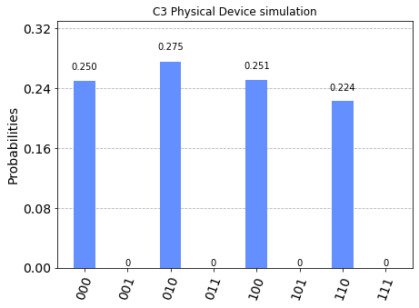
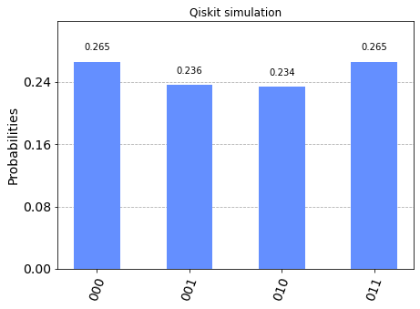

C3 Simulator as a backend for Qiskit Experiments
================================================

This notebook demonstrates the use of the C3 Simulator with a high-level
quantum programming framework `Qiskit <https://www.qiskit.org>`__. You
must additionally install qiskit and matplotlib to run this example.

.. code:: ipython3

    !pip install -q qiskit matplotlib

.. code:: ipython3

    from pprint import pprint
    import numpy as np
    from c3.qiskit import C3Provider
    from c3.qiskit.c3_gates import RX90pGate
    from qiskit import transpile, execute, QuantumCircuit, Aer
    from qiskit.tools.visualization import plot_histogram

Define a basic Quantum circuit
------------------------------

.. code:: ipython3

    qc = QuantumCircuit(3, 3)
    qc.append(RX90pGate(), [0])
    qc.append(RX90pGate(), [1])

.. parsed-literal::

    <qiskit.circuit.instructionset.InstructionSet at 0x17b189980>

.. code:: ipython3

    qc.draw()

.. raw:: html

    <pre style="word-wrap: normal;white-space: pre;background: #fff0;line-height: 1.1;font-family: &quot;Courier New&quot;,Courier,monospace">     ┌────────────┐
    q_0: ┤ Rx90p(π/2) ├
         ├────────────┤
    q_1: ┤ Rx90p(π/2) ├
         └────────────┘
    q_2: ──────────────
    
    c: 3/══════════════
                       </pre>

Get the C3 Provider and Backend
-------------------------------

.. code:: ipython3

    c3_provider = C3Provider()
    c3_backend = c3_provider.get_backend("c3_qasm_physics_simulator")

.. code:: ipython3

    config = c3_backend.configuration()
    
    print("Name: {0}".format(config.backend_name))
    print("Version: {0}".format(config.backend_version))
    print("Max Qubits: {0}".format(config.n_qubits))
    print("OpenPulse Support: {0}".format(config.open_pulse))
    print("Basis Gates: {0}".format(config.basis_gates))

.. parsed-literal::

    Name: c3_qasm_physics_simulator
    Version: 0.1
    Max Qubits: 10
    OpenPulse Support: False
    Basis Gates: ['cx', 'rx']

Run a physical device simulation using C3
-----------------------------------------

.. code:: ipython3

    c3_backend.set_device_config("qiskit.cfg")
    c3_job = c3_backend.run(qc)
    result = c3_job.result()

.. parsed-literal::

    No measurements in circuit "circuit-0", classical register will remain all zeros.
    2022-01-01 03:30:00.931206: I tensorflow/compiler/mlir/mlir_graph_optimization_pass.cc:185] None of the MLIR Optimization Passes are enabled (registered 2)
    2022-01-01 03:30:00.933640: W tensorflow/core/platform/profile_utils/cpu_utils.cc:128] Failed to get CPU frequency: 0 Hz

.. code:: ipython3

    res_counts = result.get_counts()
    pprint(res_counts)

.. parsed-literal::

    {'000': 0.2501927838288728,
     '001': 1.6223933410984962e-29,
     '010': 0.27496041223138323,
     '011': 1.1175740719685343e-31,
     '100': 0.25116573990906244,
     '101': 2.4732633272223437e-33,
     '110': 0.22368106403066923,
     '111': 6.525386280486658e-35}

.. code:: ipython3

    plot_histogram(res_counts, title='C3 Physical Device simulation')

As we can see above, the c3 simulator correctly calculates the
populations while accounting for non-optimal pulses and device
limitations.

Run Simulation and verify results on Qiskit simulator
-----------------------------------------------------

Qiskit uses little-endian bit ordering while most Quantum Computing
literature uses big-endian. This is reflected in the reversed ordering
of qubit labels here.

Ref: `Basis Vector Ordering in
Qiskit <https://qiskit.org/documentation/tutorials/circuits/3_summary_of_quantum_operations.html#Basis-vector-ordering-in-Qiskit>`__

.. code:: ipython3

    qiskit_simulator = Aer.get_backend('qasm_simulator')
    qc.measure([0, 1, 2], [0, 1, 2])
    qiskit_result = execute(qc, qiskit_simulator, shots=1000).result()
    counts = qiskit_result.get_counts(qc)
    plot_histogram(counts, title='Qiskit simulation')

.. parsed-literal::

    /opt/homebrew/Caskroom/miniforge/base/envs/c3-dev/lib/python3.8/site-packages/numpy/linalg/linalg.py:2159: RuntimeWarning: divide by zero encountered in det
      r = _umath_linalg.det(a, signature=signature)
    /opt/homebrew/Caskroom/miniforge/base/envs/c3-dev/lib/python3.8/site-packages/numpy/linalg/linalg.py:2159: RuntimeWarning: invalid value encountered in det
      r = _umath_linalg.det(a, signature=signature)

