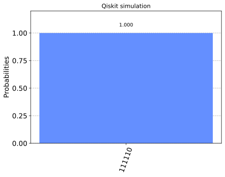

C3 Simulator as a backend for Qiskit Experiments
================================================

This notebook demonstrates the use of the C3 Simulator with a high-level
quantum programming framework `Qiskit <https://www.qiskit.org>`__. You
must additionally install qiskit and matplotlib to run this example.

.. code:: ipython3

    #!pip install qiskit==0.23.2 matplotlib==3.3.4

.. code:: ipython3

    from c3.qiskit import C3Provider
    from qiskit import transpile, execute, QuantumCircuit, Aer
    from qiskit.tools.visualization import plot_histogram, plot_state_city

Define a basic Quantum circuit
-------------------------------------------

.. code:: ipython3

    qc = QuantumCircuit(6, 6)
    qc.x(0)
    qc.z(0)
    qc.cx(0,1)
    qc.x(0)
    qc.z(2)
    qc.x(2)
    qc.y(3)
    qc.cx(3, 4)
    qc.cx(4, 5)
    qc.measure([0, 1, 2, 3, 4, 5], [0, 1, 2, 3, 4, 5])

.. parsed-literal::

    <qiskit.circuit.instructionset.InstructionSet at 0x7f2ad02675b0>

.. code:: ipython3

    qc.draw()

.. raw:: html

    <pre style="word-wrap: normal;white-space: pre;background: #fff0;line-height: 1.1;font-family: &quot;Courier New&quot;,Courier,monospace">     ┌───┐┌───┐     ┌───┐            ┌─┐
    q_0: ┤ X ├┤ Z ├──■──┤ X ├────────────┤M├
         └───┘└───┘┌─┴─┐└───┘   ┌─┐      └╥┘
    q_1: ──────────┤ X ├────────┤M├───────╫─
         ┌───┐┌───┐└───┘ ┌─┐    └╥┘       ║ 
    q_2: ┤ Z ├┤ X ├──────┤M├─────╫────────╫─
         ├───┤└───┘      └╥┘ ┌─┐ ║        ║ 
    q_3: ┤ Y ├──■─────────╫──┤M├─╫────────╫─
         └───┘┌─┴─┐       ║  └╥┘ ║ ┌─┐    ║ 
    q_4: ─────┤ X ├──■────╫───╫──╫─┤M├────╫─
              └───┘┌─┴─┐  ║   ║  ║ └╥┘┌─┐ ║ 
    q_5: ──────────┤ X ├──╫───╫──╫──╫─┤M├─╫─
                   └───┘  ║   ║  ║  ║ └╥┘ ║ 
    c: 6/═════════════════╩═══╩══╩══╩══╩══╩═
                          2   3  1  4  5  0 </pre>

Get the C3 Provider and Backend
-------------------------------

.. code:: ipython3

    c3_provider = C3Provider()
    c3_backend = c3_provider.get_backend("c3_qasm_perfect_simulator")

.. code:: ipython3

    config = c3_backend.configuration()
    
    print("Name: {0}".format(config.backend_name))
    print("Version: {0}".format(config.backend_version))
    print("Max Qubits: {0}".format(config.n_qubits))
    print("OpenPulse Support: {0}".format(config.open_pulse))
    print("Basis Gates: {0}".format(config.basis_gates))

.. parsed-literal::

    Name: c3_qasm_perfect_simulator
    Version: 0.1
    Max Qubits: 20
    OpenPulse Support: False
    Basis Gates: ['cx', 'cy', 'cz', 'iSwap', 'id', 'x', 'y', 'z']

Let's view how the Qiskit Transpiler will convert the circuit
~~~~~~~~~~~~~~~~~~~~~~~~~~~~~~~~~~~~~~~~~~~~~~~~~~~~~~~~~~~~~

.. code:: ipython3

    trans_qc = transpile(qc, c3_backend)

.. code:: ipython3

    trans_qc.draw()

.. raw:: html

    <pre style="word-wrap: normal;white-space: pre;background: #fff0;line-height: 1.1;font-family: &quot;Courier New&quot;,Courier,monospace">     ┌───┐┌───┐     ┌───┐            ┌─┐
    q_0: ┤ X ├┤ Z ├──■──┤ X ├────────────┤M├
         └───┘└───┘┌─┴─┐└───┘   ┌─┐      └╥┘
    q_1: ──────────┤ X ├────────┤M├───────╫─
         ┌───┐┌───┐└───┘ ┌─┐    └╥┘       ║ 
    q_2: ┤ Z ├┤ X ├──────┤M├─────╫────────╫─
         ├───┤└───┘      └╥┘ ┌─┐ ║        ║ 
    q_3: ┤ Y ├──■─────────╫──┤M├─╫────────╫─
         └───┘┌─┴─┐       ║  └╥┘ ║ ┌─┐    ║ 
    q_4: ─────┤ X ├──■────╫───╫──╫─┤M├────╫─
              └───┘┌─┴─┐  ║   ║  ║ └╥┘┌─┐ ║ 
    q_5: ──────────┤ X ├──╫───╫──╫──╫─┤M├─╫─
                   └───┘  ║   ║  ║  ║ └╥┘ ║ 
    c: 6/═════════════════╩═══╩══╩══╩══╩══╩═
                          2   3  1  4  5  0 </pre>

Run an ideal device simulation using C3
---------------------------------------

.. code:: ipython3

    c3_backend.set_device_config("quickstart.hjson")
    c3_job = execute(qc, c3_backend, shots=1000)
    result = c3_job.result()

.. code:: ipython3

    res_counts = result.get_counts(qc)
    print(res_counts)

.. parsed-literal::

    {'011111': 1000}

.. code:: ipython3

    plot_histogram(res_counts, title='C3 Perfect Devices simulation')

Run Simulation and verify results on Qiskit simulator
-----------------------------------------------------

.. code:: ipython3

    qiskit_simulator = Aer.get_backend('qasm_simulator')
    qiskit_result = execute(qc, qiskit_simulator, shots=1000).result()
    counts = qiskit_result.get_counts(qc)
    plot_histogram(counts, title='Qiskit simulation')

