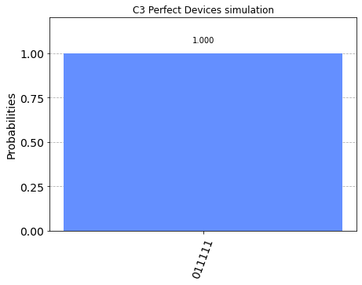

C3 Backend for Qiskit Experiments
================================================

This notebook demonstrates the use of the C3 Simulator with a high-level
quantum programming framework `Qiskit <https://www.qiskit.org>`__. You
must additionally install qiskit and matplotlib to run this example.

.. code:: ipython3

    #!pip install qiskit matplotlib

.. code:: ipython3

    from c3.qiskit import C3Provider
    from qiskit import transpile, execute, QuantumCircuit
    from qiskit.tools.visualization import plot_histogram, plot_state_city

Define a basic circuit to make a Bell State
-------------------------------------------

.. code:: ipython3

    qc = QuantumCircuit(6, 6)
    qc.x(0)
    qc.cx(0,1)
    qc.measure([0, 1], [0, 1])

.. parsed-literal::

    <qiskit.circuit.instructionset.InstructionSet at 0x7f086f0b3280>

.. code:: ipython3

    qc.draw()

.. raw:: html

    <pre style="word-wrap: normal;white-space: pre;background: #fff0;line-height: 1.1;font-family: &quot;Courier New&quot;,Courier,monospace">     ┌───┐     ┌─┐   
    q_0: ┤ X ├──■──┤M├───
         └───┘┌─┴─┐└╥┘┌─┐
    q_1: ─────┤ X ├─╫─┤M├
              └───┘ ║ └╥┘
    q_2: ───────────╫──╫─
                    ║  ║ 
    q_3: ───────────╫──╫─
                    ║  ║ 
    q_4: ───────────╫──╫─
                    ║  ║ 
    q_5: ───────────╫──╫─
                    ║  ║ 
    c: 6/═══════════╩══╩═
                    0  1 </pre>

Get the C3 Provider and Backend
-------------------------------

.. code:: ipython3

    c3_provider = C3Provider()
    c3_backend = c3_provider.get_backend("c3_qasm_simulator")

.. code:: ipython3

    config = c3_backend.configuration()
    
    print("Name: {0}".format(config.backend_name))
    print("Version: {0}".format(config.backend_version))
    print("Max Qubits: {0}".format(config.n_qubits))
    print("OpenPulse Support: {0}".format(config.open_pulse))
    print("Basis Gates: {0}".format(config.basis_gates))

.. parsed-literal::

    Name: c3_qasm_simulator
    Version: 1.1
    Max Qubits: 15
    OpenPulse Support: False
    Basis Gates: ['u3', 'cx', 'id', 'x']

Let’s view how the Qiskit Transpiler will convert the circuit
~~~~~~~~~~~~~~~~~~~~~~~~~~~~~~~~~~~~~~~~~~~~~~~~~~~~~~~~~~~~~

.. code:: ipython3

    trans_qc = transpile(qc, c3_backend)

.. code:: ipython3

    trans_qc.draw()

.. raw:: html

    <pre style="word-wrap: normal;white-space: pre;background: #fff0;line-height: 1.1;font-family: &quot;Courier New&quot;,Courier,monospace">     ┌───┐     ┌─┐   
    q_0: ┤ X ├──■──┤M├───
         └───┘┌─┴─┐└╥┘┌─┐
    q_1: ─────┤ X ├─╫─┤M├
              └───┘ ║ └╥┘
    q_2: ───────────╫──╫─
                    ║  ║ 
    q_3: ───────────╫──╫─
                    ║  ║ 
    q_4: ───────────╫──╫─
                    ║  ║ 
    q_5: ───────────╫──╫─
                    ║  ║ 
    c: 6/═══════════╩══╩═
                    0  1 </pre>

Run the simulation job
----------------------

.. code:: ipython3

    c3_backend.set_device_config("quickstart.hjson")
    c3_job = execute(qc, c3_backend, shots=1000)
    result = c3_job.result()

.. code:: ipython3

    res_counts = result.get_counts(qc)
    print(res_counts)

.. parsed-literal::

    {'000000': 164, '010000': 799, '100000': 14}

.. code:: ipython3

    plot_histogram(res_counts, title='6-qubit physics simulation')

