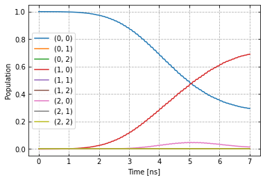
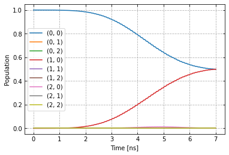
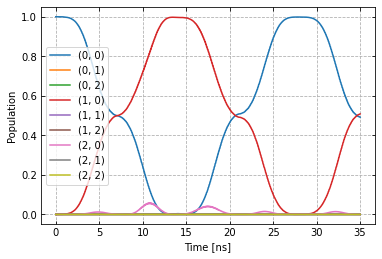
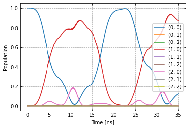

Open-loop optimal control
^^^^^^^^^^^^^^^^^^^^^^^^^

In order to improve the gate from the previous example :ref:`setup-example`,
we create the optimizer object for open-loop optimal control. Examining the
previous dynamics

in addition to over-rotation, we notice some leakage
into the :math:`|2,0>` state and enable a DRAG option.
Details on DRAG can be found
`here <https://arxiv.org/abs/1809.04919>`_. The main principle is adding a
phase-shifted component proportional to the derivative of the original
signal. With automatic differentiation, our AWG can perform this
operation automatically for arbitrary shapes.

.. code-block:: python

    generator.devices['AWG'].enable_drag_2()

At the moment there are two implementations of DRAG, variant 2 is
independent of the AWG resolution.

To define which parameters we optimize, we write the gateset_opt_map, a
nested list of tuples that identifies each parameter.

.. code-block:: python

    opt_gates = ["rx90p[0]"]
    gateset_opt_map=[
        [
          ("rx90p[0]", "d1", "gauss", "amp"),
        ],
        [
          ("rx90p[0]", "d1", "gauss", "freq_offset"),
        ],
        [
          ("rx90p[0]", "d1", "gauss", "xy_angle"),
        ],
        [
          ("RX90p:Id", "d1", "gauss", "delta"),
        ]
    ]
    parameter_map.set_opt_map(gateset_opt_map)

We can look at the parameter values this opt_map specified with

.. code-block:: python

    parameter_map.print_parameters()

.. parsed-literal::

    rx90p[0]-d1-gauss-amp                 : 500.000 mV
    rx90p[0]-d1-gauss-freq_offset         : -53.000 MHz 2pi
    rx90p[0]-d1-gauss-xy_angle            : -444.089 arad
    rx90p[0]-d1-gauss-delta               : -1.000

.. code-block:: python

    from c3.optimizers.optimalcontrol import C1
    import c3.libraries.algorithms as algorithms

The C1 object will handle the optimization for us. As a fidelity
function we choose average fidelity as well as LBFG-S (a wrapper of the
scipy implementation) from our library. See those libraries for how
these functions are defined and how to supply your own, if necessary.

.. code-block:: python

    import os
    import tempfile

    # Create a temporary directory to store logfiles, modify as needed
    log_dir = os.path.join(tempfile.TemporaryDirectory().name, "c3logs")

    opt = C1(
        dir_path=log_dir,
        fid_func=fidelities.average_infid_set,
        fid_subspace=["Q1", "Q2"],
        pmap=parameter_map,
        algorithm=algorithms.lbfgs,
        options={"maxfun" : 10},
        run_name="better_X90"
    )

Finally we supply our defined experiment.

.. code-block:: python

    exp.set_opt_gates(opt_gates)
    opt.set_exp(exp)

Everything is in place to start the optimization.

.. code-block:: python

    opt.optimize_controls()

After a few steps we have improved the gate significantly, as we can
check with

.. code-block:: python

    opt.current_best_goal

.. parsed-literal::

    0.00063

And by looking at the same sequences as before.

.. code-block:: python

    plot_dynamics(exp, init_state, barely_a_seq)

.. code-block:: python

    plot_dynamics(exp, init_state, barely_a_seq * 5)

Compared to before the optimization.

