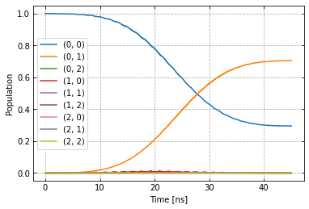
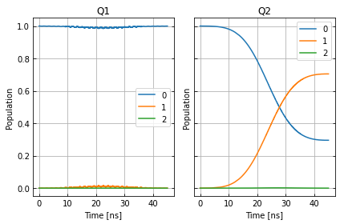
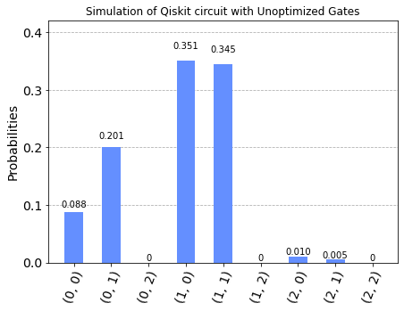
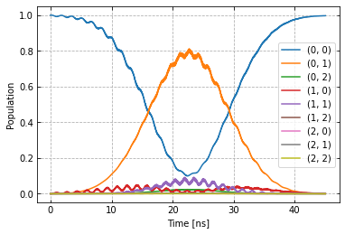
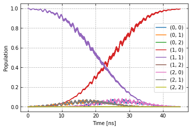
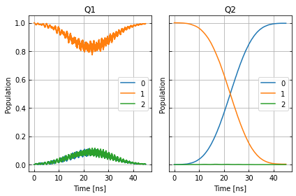
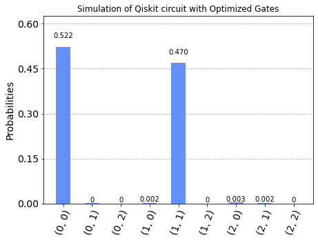

Entangling gate on two coupled qubits
~~~~~~~~~~~~~~~~~~~~~~~~~~~~~~~~~~~~~

Imports
^^^^^^^

.. code:: ipython3

    !pip install -q -U pip
    !pip install -q matplotlib

.. code:: ipython3

    # System imports
    import copy
    import numpy as np
    import time
    import itertools
    import matplotlib.pyplot as plt
    import tensorflow as tf
    import tensorflow_probability as tfp
    from typing import List
    from pprint import pprint
    
    # Main C3 objects
    from c3.c3objs import Quantity as Qty
    from c3.parametermap import ParameterMap as PMap
    from c3.experiment import Experiment as Exp
    from c3.model import Model as Mdl
    from c3.generator.generator import Generator as Gnr
    
    # Building blocks
    import c3.generator.devices as devices
    import c3.signal.gates as gates
    import c3.libraries.chip as chip
    import c3.signal.pulse as pulse
    import c3.libraries.tasks as tasks
    
    # Libs and helpers
    import c3.libraries.algorithms as algorithms
    import c3.libraries.hamiltonians as hamiltonians
    import c3.libraries.fidelities as fidelities
    import c3.libraries.envelopes as envelopes
    import c3.utils.qt_utils as qt_utils
    import c3.utils.tf_utils as tf_utils
    
    # Qiskit related modules
    from c3.qiskit import C3Provider
    from c3.qiskit.c3_gates import RX90pGate
    from qiskit import QuantumCircuit, Aer, execute
    from qiskit.tools.visualization import plot_histogram

Model components
^^^^^^^^^^^^^^^^

The model consists of two qubits with 3 levels each and slightly
different parameters:

.. code:: ipython3

    qubit_lvls = 3
    freq_q1 = 5e9
    anhar_q1 = -210e6
    t1_q1 = 27e-6
    t2star_q1 = 39e-6
    qubit_temp = 50e-3
    
    q1 = chip.Qubit(
        name="Q1",
        desc="Qubit 1",
        freq=Qty(value=freq_q1, min_val=4.995e9, max_val=5.005e9, unit='Hz 2pi'),
        anhar=Qty(value=anhar_q1, min_val=-380e6, max_val=-120e6, unit='Hz 2pi'),
        hilbert_dim=qubit_lvls,
        t1=Qty(value=t1_q1, min_val=1e-6, max_val=90e-6, unit='s'),
        t2star=Qty(value=t2star_q1, min_val=10e-6, max_val=90e-3, unit='s'),
        temp=Qty(value=qubit_temp, min_val=0.0, max_val=0.12, unit='K')
    )
    
    freq_q2 = 5.6e9
    anhar_q2 = -240e6
    t1_q2 = 23e-6
    t2star_q2 = 31e-6
    q2 = chip.Qubit(
        name="Q2",
        desc="Qubit 2",
        freq=Qty(value=freq_q2, min_val=5.595e9, max_val=5.605e9, unit='Hz 2pi'),
        anhar=Qty(value=anhar_q2, min_val=-380e6, max_val=-120e6, unit='Hz 2pi'),
        hilbert_dim=qubit_lvls,
        t1=Qty(value=t1_q2, min_val=1e-6, max_val=90e-6,unit='s'),
        t2star=Qty(value=t2star_q2, min_val=10e-6, max_val=90e-6, unit='s'),
        temp=Qty(value=qubit_temp, min_val=0.0, max_val=0.12, unit='K')
    )

There is a static coupling in x-direction between them:
:math:`(b_1+b_1^\dagger)(b_2+b_2^\dagger)`

.. code:: ipython3

    coupling_strength = 50e6
    q1q2 = chip.Coupling(
        name="Q1-Q2",
        desc="coupling",
        comment="Coupling qubit 1 to qubit 2",
        connected=["Q1", "Q2"],
        strength=Qty(
            value=coupling_strength,
            min_val=-1 * 1e3 ,
            max_val=200e6 ,
            unit='Hz 2pi'
        ),
        hamiltonian_func=hamiltonians.int_XX
    )

and each qubit has a drive line

.. code:: ipython3

    drive1 = chip.Drive(
        name="d1",
        desc="Drive 1",
        comment="Drive line 1 on qubit 1",
        connected=["Q1"],
        hamiltonian_func=hamiltonians.x_drive
    )
    drive2 = chip.Drive(
        name="d2",
        desc="Drive 2",
        comment="Drive line 2 on qubit 2",
        connected=["Q2"],
        hamiltonian_func=hamiltonians.x_drive
    )

All parts are collected in the model. The initial state will be thermal
at a non-vanishing temperature.

.. code:: ipython3

    init_temp = 50e-3
    init_ground = tasks.InitialiseGround(
        init_temp=Qty(value=init_temp, min_val=-0.001, max_val=0.22, unit='K')
    )
    
    model = Mdl(
        [q1, q2], # Individual, self-contained components
        [drive1, drive2, q1q2],  # Interactions between components
        # [init_ground] # SPAM processing
    )
    model.set_lindbladian(False)
    model.set_dressed(True)

Control signals
^^^^^^^^^^^^^^^

The devices for the control line are set up

.. code:: ipython3

    sim_res = 100e9 # Resolution for numerical simulation
    awg_res = 2e9 # Realistic, limited resolution of an AWG
    v2hz = 1e9
    
    lo = devices.LO(name='lo', resolution=sim_res)
    awg = devices.AWG(name='awg', resolution=awg_res)
    mixer = devices.Mixer(name='mixer')
    resp = devices.Response(
        name='resp',
        rise_time=Qty(value=0.3e-9, min_val=0.05e-9, max_val=0.6e-9, unit='s'),
        resolution=sim_res
    )
    dig_to_an = devices.DigitalToAnalog(name="dac", resolution=sim_res)
    v_to_hz = devices.VoltsToHertz(
        name='v_to_hz',
        V_to_Hz=Qty(value=v2hz, min_val=0.9e9, max_val=1.1e9, unit='Hz/V')
    )

The generator combines the parts of the signal generation and assignes a
signal chain to each control line.

.. code:: ipython3

    generator = Gnr(
            devices={
                "LO": lo,
                "AWG": awg,
                "DigitalToAnalog": dig_to_an,
                "Response": resp,
                "Mixer": mixer,
                "VoltsToHertz": v_to_hz
            },
            chains={
                "d1": {
                    "LO": [],
                    "AWG": [],
                    "DigitalToAnalog": ["AWG"],
                    "Response": ["DigitalToAnalog"],
                    "Mixer": ["LO", "Response"],
                    "VoltsToHertz": ["Mixer"],
                },
                "d2": {
                    "LO": [],
                    "AWG": [],
                    "DigitalToAnalog": ["AWG"],
                    "Response": ["DigitalToAnalog"],
                    "Mixer": ["LO", "Response"],
                    "VoltsToHertz": ["Mixer"],
                }
            }
        )

Gates-set and Parameter map
^^^^^^^^^^^^^^^^^^^^^^^^^^^

Following a general cross resonance scheme, both qubits will be
resonantly driven at the frequency of qubit 2 with a Gaussian envelope.
We drive qubit 1 (the control) at the frequency of qubit 2 (the target)
with a higher amplitude to compensate for the reduced Rabi frequency.

.. code:: ipython3

    t_final_2Q = 45e-9
    sideband = 50e6
    gauss_params_2Q_1 = {
        'amp': Qty(value=0.8, min_val=0.2, max_val=3, unit="V"),
        't_final': Qty(value=t_final_2Q, min_val=0.5 * t_final_2Q, max_val=1.5 * t_final_2Q, unit="s"),
        'sigma': Qty(value=t_final_2Q / 4, min_val=t_final_2Q / 8, max_val=t_final_2Q / 2, unit="s"),
        'xy_angle': Qty(value=0.0, min_val=-0.5 * np.pi, max_val=2.5 * np.pi, unit='rad'),
        'freq_offset': Qty(value=-sideband - 3e6, min_val=-56 * 1e6, max_val=-52 * 1e6, unit='Hz 2pi'),
        'delta': Qty(value=-1, min_val=-5, max_val=3, unit="")
    }
    
    gauss_params_2Q_2 = {
        'amp': Qty(value=0.03, min_val=0.02, max_val=0.6, unit="V"),
        't_final': Qty(value=t_final_2Q, min_val=0.5 * t_final_2Q, max_val=1.5 * t_final_2Q, unit="s"),
        'sigma': Qty(value=t_final_2Q / 4, min_val=t_final_2Q / 8, max_val=t_final_2Q / 2, unit="s"),
        'xy_angle': Qty(value=0.0, min_val=-0.5 * np.pi, max_val=2.5 * np.pi, unit='rad'),
        'freq_offset': Qty(value=-sideband - 3e6, min_val=-56 * 1e6, max_val=-52 * 1e6, unit='Hz 2pi'),
        'delta': Qty(value=-1, min_val=-5, max_val=3, unit="")
    }
    
    gauss_env_2Q_1 = pulse.Envelope(
        name="gauss1",
        desc="Gaussian envelope on drive 1",
        params=gauss_params_2Q_1,
        shape=envelopes.gaussian_nonorm
    )
    gauss_env_2Q_2 = pulse.Envelope(
        name="gauss2",
        desc="Gaussian envelope on drive 2",
        params=gauss_params_2Q_2,
        shape=envelopes.gaussian_nonorm
    )

We choose a single qubit gate time of 7ns and a gaussian envelope shape
with a list of parameters.

.. code:: ipython3

    t_final_1Q = 7e-9   # Time for single qubit gates
    sideband = 50e6 
    gauss_params_single = {
        'amp': Qty(
            value=0.5,
            min_val=0.2,
            max_val=0.6,
            unit="V"
        ),
        't_final': Qty(
            value=t_final_1Q,
            min_val=0.5 * t_final_1Q,
            max_val=1.5 * t_final_1Q,
            unit="s"
        ),
        'sigma': Qty(
            value=t_final_1Q / 4,
            min_val=t_final_1Q / 8,
            max_val=t_final_1Q / 2,
            unit="s"
        ),
        'xy_angle': Qty(
            value=0.0,
            min_val=-0.5 * np.pi,
            max_val=2.5 * np.pi,
            unit='rad'
        ),
        'freq_offset': Qty(
            value=-sideband - 3e6 ,
            min_val=-56 * 1e6 ,
            max_val=-52 * 1e6 ,
            unit='Hz 2pi'
        ),
        'delta': Qty(
            value=-1,
            min_val=-5,
            max_val=3,
            unit=""
        )
    }

.. code:: ipython3

    gauss_env_1Q = pulse.Envelope(
        name="gauss",
        desc="Gaussian comp for single-qubit gates",
        params=gauss_params_single,
        shape=envelopes.gaussian_nonorm
    )

We also define a gate that represents no driving (used for the single
qubit gates).

.. code:: ipython3

    nodrive_env = pulse.Envelope(
        name="no_drive",
        params={
            't_final': Qty(
                value=t_final_1Q,
                min_val=0.5 * t_final_1Q,
                max_val=1.5 * t_final_1Q,
                unit="s"
            )
        },
        shape=envelopes.no_drive
    )

The carrier signal of each drive for the 2 Qubit gates is set to the
resonance frequency of the target qubit.

.. code:: ipython3

    lo_freq_q1 = freq_q1 + sideband
    lo_freq_q2 = freq_q2 + sideband
    
    carr_2Q_1 = pulse.Carrier(
        name="carrier",
        desc="Carrier on drive 1",
        params={
            'freq': Qty(value=lo_freq_q2, min_val=0.9 * lo_freq_q2, max_val=1.1 * lo_freq_q2, unit='Hz 2pi'),
            'framechange': Qty(value=0.0, min_val=-np.pi, max_val=3 * np.pi, unit='rad')
        }
    )
    
    carr_2Q_2 = pulse.Carrier(
        name="carrier",
        desc="Carrier on drive 2",
        params={
            'freq': Qty(value=lo_freq_q2, min_val=0.9 * lo_freq_q2, max_val=1.1 * lo_freq_q2, unit='Hz 2pi'),
            'framechange': Qty(value=0.0, min_val=-np.pi, max_val=3 * np.pi, unit='rad')
        }
    )

We specify the drive tones for the 1Q gates with an offset from the
qubit frequencies. As is done in experiment, we will later adjust the
resonance by modulating the envelope function.

.. code:: ipython3

    carr_1Q_1 = pulse.Carrier(
        name="carrier",
        desc="Frequency of the local oscillator",
        params={
        'freq': Qty(
            value=lo_freq_q1,
            min_val=0.9 * lo_freq_q1 ,
            max_val=1.1 * lo_freq_q1 ,
            unit='Hz 2pi'
        ),
        'framechange': Qty(
            value=0.0,
            min_val= -np.pi,
            max_val= 3 * np.pi,
            unit='rad'
        )
    }
    )
    
    carr_1Q_2 = pulse.Carrier(
        name="carrier",
        desc="Frequency of the local oscillator",
        params={
        'freq': Qty(
            value=lo_freq_q2,
            min_val=0.9 * lo_freq_q2 ,
            max_val=1.1 * lo_freq_q2 ,
            unit='Hz 2pi'
        ),
        'framechange': Qty(
            value=0.0,
            min_val= -np.pi,
            max_val= 3 * np.pi,
            unit='rad'
        )
    }
    )

Instructions
^^^^^^^^^^^^

The instruction to be optimised is a CNOT gates controlled by qubit 1.

.. code:: ipython3

    # CNOT comtrolled by qubit 1
    cnot12 = gates.Instruction(
        name="cx", targets=[0, 1], t_start=0.0, t_end=t_final_2Q, channels=["d1", "d2"],
        ideal=np.array([
            [1,0,0,0],
            [0,1,0,0],
            [0,0,0,1],
            [0,0,1,0]
        ])
    )
    cnot12.add_component(gauss_env_2Q_1, "d1")
    cnot12.add_component(carr_2Q_1, "d1")
    cnot12.add_component(gauss_env_2Q_2, "d2")
    cnot12.add_component(carr_2Q_2, "d2")
    cnot12.comps["d1"]["carrier"].params["framechange"].set_value(
        (-sideband * t_final_2Q) * 2 * np.pi % (2 * np.pi)
    )

We also add some typical single qubit gates to the instruction set.

.. code:: ipython3

    rx90p_q1 = gates.Instruction(
        name="rx90p", targets=[0], t_start=0.0, t_end=t_final_1Q, channels=["d1", "d2"]
    )
    rx90p_q2 = gates.Instruction(
        name="rx90p", targets=[1], t_start=0.0, t_end=t_final_1Q, channels=["d1", "d2"]
    )
    
    rx90p_q1.add_component(gauss_env_1Q, "d1")
    rx90p_q1.add_component(carr_1Q_1, "d1")
    
    
    rx90p_q2.add_component(gauss_env_1Q, "d2")
    rx90p_q2.add_component(carr_1Q_2, "d2")

When later compiling gates into sequences, we have to take care of the
relative rotating frames of the qubits and local oscillators. We do this
by adding a phase after each gate that realigns the frames.

.. code:: ipython3

    rx90p_q1.add_component(nodrive_env, "d2")
    rx90p_q1.add_component(copy.deepcopy(carr_1Q_2), "d2")
    rx90p_q1.comps["d2"]["carrier"].params["framechange"].set_value(
        (-sideband * t_final_1Q) * 2 * np.pi % (2 * np.pi)
    )
    
    rx90p_q2.add_component(nodrive_env, "d1")
    rx90p_q2.add_component(copy.deepcopy(carr_1Q_1), "d1")
    rx90p_q2.comps["d1"]["carrier"].params["framechange"].set_value(
        (-sideband * t_final_1Q) * 2 * np.pi % (2 * np.pi)
    )

The experiment
^^^^^^^^^^^^^^

All components are collected in the parameter map and the experiment is
set up.

.. code:: ipython3

    parameter_map = PMap(instructions=[cnot12, rx90p_q1, rx90p_q2], model=model, generator=generator)
    exp = Exp(pmap=parameter_map)

Calculate and print the propagator before the optimisation.

.. code:: ipython3

    unitaries = exp.compute_propagators()
    # print(unitaries[cnot12.get_key()])
    # print(unitaries[rx90p_q1.get_key()])

.. parsed-literal::

    2022-01-01 20:55:15.191809: I tensorflow/compiler/mlir/mlir_graph_optimization_pass.cc:185] None of the MLIR Optimization Passes are enabled (registered 2)
    2022-01-01 20:55:15.193814: W tensorflow/core/platform/profile_utils/cpu_utils.cc:128] Failed to get CPU frequency: 0 Hz

Dynamics
^^^^^^^^

The system is initialised in the state :math:`|0,1\rangle` so that a
transition to :math:`|1,1\rangle` should be visible.

.. code:: ipython3

    psi_init = [[0] * 9]
    psi_init[0][0] = 1
    init_state = tf.transpose(tf.constant(psi_init, tf.complex128))
    print(init_state)

.. parsed-literal::

    tf.Tensor(
    [[1.+0.j]
     [0.+0.j]
     [0.+0.j]
     [0.+0.j]
     [0.+0.j]
     [0.+0.j]
     [0.+0.j]
     [0.+0.j]
     [0.+0.j]], shape=(9, 1), dtype=complex128)

.. code:: ipython3

    def plot_dynamics(exp, psi_init, seq):
            """
            Plotting code for time-resolved populations.
    
            Parameters
            ----------
            psi_init: tf.Tensor
                Initial state or density matrix.
            seq: list
                List of operations to apply to the initial state.
            """
            model = exp.pmap.model
            dUs = exp.partial_propagators
            psi_t = psi_init.numpy()
            pop_t = exp.populations(psi_t, model.lindbladian)
            for gate in seq:
                for du in dUs[gate]:
                    psi_t = np.matmul(du.numpy(), psi_t)
                    pops = exp.populations(psi_t, model.lindbladian)
                    pop_t = np.append(pop_t, pops, axis=1)
    
            fig, axs = plt.subplots(1, 1)
            ts = exp.ts
            dt = ts[1] - ts[0]
            ts = np.linspace(0.0, dt*pop_t.shape[1], pop_t.shape[1])
            axs.plot(ts / 1e-9, pop_t.T)
            axs.grid(linestyle="--")
            axs.tick_params(
                direction="in", left=True, right=True, top=True, bottom=True
            )
            axs.set_xlabel('Time [ns]')
            axs.set_ylabel('Population')
            plt.legend(model.state_labels)
            pass
    
    def getQubitsPopulation(population: np.array, dims: List[int]) -> np.array:
        """
        Splits the population of all levels of a system into the populations of levels per subsystem.
        Parameters
        ----------
        population: np.array
            The time dependent population of each energy level. First dimension: level index, second dimension: time.
        dims: List[int]
            The number of levels for each subsystem.
        Returns
        -------
        np.array
            The time-dependent population of energy levels for each subsystem. First dimension: subsystem index, second
            dimension: level index, third dimension: time.
        """
        numQubits = len(dims)
    
        # create a list of all levels
        qubit_levels = []
        for dim in dims:
            qubit_levels.append(list(range(dim)))
        combined_levels = list(itertools.product(*qubit_levels))
    
        # calculate populations
        qubitsPopulations = np.zeros((numQubits, dims[0], population.shape[1]))
        for idx, levels in enumerate(combined_levels):
            for i in range(numQubits):
                qubitsPopulations[i, levels[i]] += population[idx]
        return qubitsPopulations
    
    def plotSplittedPopulation(
        exp: Exp,
        psi_init: tf.Tensor,
        sequence: List[str]
    ) -> None:
        """
        Plots time dependent populations for multiple qubits in separate plots.
        Parameters
        ----------
        exp: Experiment
            The experiment containing the model and propagators
        psi_init: np.array
            Initial state vector
        sequence: List[str]
            List of gate names that will be applied to the state
        -------
        """
        # calculate the time dependent level population
        model = exp.pmap.model
        dUs = exp.partial_propagators
        psi_t = psi_init.numpy()
        pop_t = exp.populations(psi_t, model.lindbladian)
        for gate in sequence:
            for du in dUs[gate]:
                psi_t = np.matmul(du, psi_t)
                pops = exp.populations(psi_t, model.lindbladian)
                pop_t = np.append(pop_t, pops, axis=1)
        dims = [s.hilbert_dim for s in model.subsystems.values()]
        splitted = getQubitsPopulation(pop_t, dims)
    
        # timestamps
        dt = exp.ts[1] - exp.ts[0]
        ts = np.linspace(0.0, dt * pop_t.shape[1], pop_t.shape[1])
    
        # create both subplots
        titles = list(exp.pmap.model.subsystems.keys())
        fig, axs = plt.subplots(1, len(splitted), sharey="all")
        for idx, ax in enumerate(axs):
            ax.plot(ts / 1e-9, splitted[idx].T)
            ax.tick_params(direction="in", left=True, right=True, top=False, bottom=True)
            ax.set_xlabel("Time [ns]")
            ax.set_ylabel("Population")
            ax.set_title(titles[idx])
            ax.legend([str(x) for x in np.arange(dims[idx])])
            ax.grid()
    
        plt.tight_layout()
        plt.show()
    
    sequence = [cnot12.get_key()]
    plot_dynamics(exp, init_state, sequence)
    plotSplittedPopulation(exp, init_state, sequence)

Visualisation with qiskit circuit
^^^^^^^^^^^^^^^^^^^^^^^^^^^^^^^^^

.. code:: ipython3

    qc = QuantumCircuit(2, 2)
    qc.append(RX90pGate(), [0])
    qc.cx(0, 1)
    qc.draw()

.. raw:: html

    <pre style="word-wrap: normal;white-space: pre;background: #fff0;line-height: 1.1;font-family: &quot;Courier New&quot;,Courier,monospace">     ┌────────────┐     
    q_0: ┤ Rx90p(π/2) ├──■──
         └────────────┘┌─┴─┐
    q_1: ──────────────┤ X ├
                       └───┘
    c: 2/═══════════════════
                            </pre>

.. code:: ipython3

    c3_provider = C3Provider()
    c3_backend = c3_provider.get_backend("c3_qasm_physics_simulator")
    c3_backend.set_c3_experiment(exp)

.. code:: ipython3

    c3_job_unopt = c3_backend.run(qc)
    result_unopt = c3_job_unopt.result()
    res_pops_unopt = result_unopt.data()["state_pops"]
    print("Result from unoptimized gates:")
    pprint(res_pops_unopt)

.. parsed-literal::

    No measurements in circuit "circuit-0", classical register will remain all zeros.

.. parsed-literal::

    Result from unoptimized gates:
    {'(0, 0)': 0.08793249061599799,
     '(0, 1)': 0.20140214999016118,
     '(0, 2)': 1.7916216253388795e-05,
     '(1, 0)': 0.3507070201094552,
     '(1, 1)': 0.34492529411056444,
     '(1, 2)': 5.054006496570894e-06,
     '(2, 0)': 0.009940433069486916,
     '(2, 1)': 0.005069321214083548,
     '(2, 2)': 3.20667334658816e-07}

.. code:: ipython3

    plot_histogram(res_pops_unopt, title='Simulation of Qiskit circuit with Unoptimized Gates')

Open-loop optimal control
^^^^^^^^^^^^^^^^^^^^^^^^^

Now, open-loop optimisation with DRAG enabled is set up.

.. code:: ipython3

    generator.devices['AWG'].enable_drag_2()
    
    opt_gates = [cnot12.get_key()]
    exp.set_opt_gates(opt_gates)
    
    gateset_opt_map=[
        [(cnot12.get_key(), "d1", "gauss1", "amp")],
        [(cnot12.get_key(), "d1", "gauss1", "freq_offset")],
        [(cnot12.get_key(), "d1", "gauss1", "xy_angle")],
        [(cnot12.get_key(), "d1", "gauss1", "delta")],
        [(cnot12.get_key(), "d1", "carrier", "framechange")],
        [(cnot12.get_key(), "d2", "gauss2", "amp")],
        [(cnot12.get_key(), "d2", "gauss2", "freq_offset")],
        [(cnot12.get_key(), "d2", "gauss2", "xy_angle")],
        [(cnot12.get_key(), "d2", "gauss2", "delta")],
        [(cnot12.get_key(), "d2", "carrier", "framechange")],
    ]
    parameter_map.set_opt_map(gateset_opt_map)
    
    parameter_map.print_parameters()

.. parsed-literal::

    cx[0, 1]-d1-gauss1-amp                : 800.000 mV 
    cx[0, 1]-d1-gauss1-freq_offset        : -53.000 MHz 2pi 
    cx[0, 1]-d1-gauss1-xy_angle           : -444.089 arad 
    cx[0, 1]-d1-gauss1-delta              : -1.000  
    cx[0, 1]-d1-carrier-framechange       : 4.712 rad 
    cx[0, 1]-d2-gauss2-amp                : 30.000 mV 
    cx[0, 1]-d2-gauss2-freq_offset        : -53.000 MHz 2pi 
    cx[0, 1]-d2-gauss2-xy_angle           : -444.089 arad 
    cx[0, 1]-d2-gauss2-delta              : -1.000  
    cx[0, 1]-d2-carrier-framechange       : 0.000 rad 
    

As a fidelity function we choose unitary fidelity as well as LBFG-S (a
wrapper of the scipy implementation) from our library.

.. code:: ipython3

    import os
    import tempfile
    from c3.optimizers.optimalcontrol import OptimalControl
    
    log_dir = os.path.join(tempfile.TemporaryDirectory().name, "c3logs")
    opt = OptimalControl(
        dir_path=log_dir,
        fid_func=fidelities.unitary_infid_set,
        fid_subspace=["Q1", "Q2"],
        pmap=parameter_map,
        algorithm=algorithms.lbfgs,
        options={
            "maxfun": 25
        },
        run_name="cnot12"
    )

Start the optimisation

.. code:: ipython3

    exp.set_opt_gates(opt_gates)
    opt.set_exp(exp)
    opt.optimize_controls()

.. parsed-literal::

    C3:STATUS:Saving as: /var/folders/04/np4lgk2d7sq6w0dpn758sgp80000gn/T/tmpryftkry4/c3logs/cnot12/2022_01_01_T_20_55_19/open_loop.c3log

The final parameters and the fidelity are

.. code:: ipython3

    parameter_map.print_parameters()
    print(opt.current_best_goal)

.. parsed-literal::

    cx[0, 1]-d1-gauss1-amp                : 2.359 V 
    cx[0, 1]-d1-gauss1-freq_offset        : -53.252 MHz 2pi 
    cx[0, 1]-d1-gauss1-xy_angle           : 587.818 mrad 
    cx[0, 1]-d1-gauss1-delta              : -743.473 m 
    cx[0, 1]-d1-carrier-framechange       : -815.216 mrad 
    cx[0, 1]-d2-gauss2-amp                : 56.719 mV 
    cx[0, 1]-d2-gauss2-freq_offset        : -53.176 MHz 2pi 
    cx[0, 1]-d2-gauss2-xy_angle           : -135.515 mrad 
    cx[0, 1]-d2-gauss2-delta              : -519.864 m 
    cx[0, 1]-d2-carrier-framechange       : 598.919 mrad 
    
    0.0055213431696764514

Results of the optimisation
^^^^^^^^^^^^^^^^^^^^^^^^^^^

Plotting the dynamics with the same initial state:

.. code:: ipython3

    plot_dynamics(exp, init_state, sequence)
    plotSplittedPopulation(exp, init_state, sequence)

Now we plot the dynamics for the control in the excited state.

.. code:: ipython3

    psi_init = [[0] * 9]
    psi_init[0][4] = 1
    init_state = tf.transpose(tf.constant(psi_init, tf.complex128))
    print(init_state)
    
    plot_dynamics(exp, init_state, sequence)
    plotSplittedPopulation(exp, init_state, sequence)

.. parsed-literal::

    tf.Tensor(
    [[0.+0.j]
     [0.+0.j]
     [0.+0.j]
     [0.+0.j]
     [1.+0.j]
     [0.+0.j]
     [0.+0.j]
     [0.+0.j]
     [0.+0.j]], shape=(9, 1), dtype=complex128)

As intended, the dynamics of the target is dependent on the control
qubit performing a flip if the control is excited and an identity
otherwise.

Optimizing the single qubit gate on Qubit 1
^^^^^^^^^^^^^^^^^^^^^^^^^^^^^^^^^^^^^^^^^^^

.. code:: ipython3

    opt_gates = [rx90p_q1.get_key()]
    gateset_opt_map=[
        [
          (rx90p_q1.get_key(), "d1", "gauss", "amp"),
        ],
        [
          (rx90p_q1.get_key(), "d1", "gauss", "freq_offset"),
        ],
        [
          (rx90p_q1.get_key(), "d1", "gauss", "xy_angle"),
        ],
        [
          (rx90p_q1.get_key(), "d1", "gauss", "delta"),
        ],   
        [
          (rx90p_q1.get_key(), "d1", "carrier", "framechange"),
        ]
    ]
    parameter_map.set_opt_map(gateset_opt_map)
    parameter_map.print_parameters()

.. parsed-literal::

    rx90p[0]-d1-gauss-amp                 : 500.000 mV 
    rx90p[0]-d1-gauss-freq_offset         : -53.000 MHz 2pi 
    rx90p[0]-d1-gauss-xy_angle            : -444.089 arad 
    rx90p[0]-d1-gauss-delta               : -1.000  
    rx90p[0]-d1-carrier-framechange       : 0.000 rad 
    

.. code:: ipython3

    opt_1Q = OptimalControl(
        dir_path=log_dir,
        fid_func=fidelities.unitary_infid_set,
        fid_subspace=["Q1", "Q2"],
        pmap=parameter_map,
        algorithm=algorithms.lbfgs,
        options={
            "maxfun": 25
        },
        run_name="rx90p_q1"
    )

.. code:: ipython3

    exp.set_opt_gates(opt_gates)
    opt_1Q.set_exp(exp)
    opt_1Q.optimize_controls()

.. parsed-literal::

    C3:STATUS:Saving as: /var/folders/04/np4lgk2d7sq6w0dpn758sgp80000gn/T/tmpryftkry4/c3logs/rx90p_q1/2022_01_01_T_20_58_09/open_loop.c3log

.. code:: ipython3

    parameter_map.print_parameters()
    print(opt_1Q.current_best_goal)

.. parsed-literal::

    rx90p[0]-d1-gauss-amp                 : 390.140 mV 
    rx90p[0]-d1-gauss-freq_offset         : -52.986 MHz 2pi 
    rx90p[0]-d1-gauss-xy_angle            : -195.771 mrad 
    rx90p[0]-d1-gauss-delta               : -964.376 m 
    rx90p[0]-d1-carrier-framechange       : -282.109 mrad 
    
    0.00575481536619904

Before running the qiskit simulation, we must call ``set_opt_gates()``
to ensure propagators are calculated for all the required gates

.. code:: ipython3

    exp.set_opt_gates([rx90p_q1.get_key(), cnot12.get_key()])

.. code:: ipython3

    c3_job_opt = c3_backend.run(qc)
    result_opt = c3_job_opt.result()
    res_pops_opt = result_opt.data()["state_pops"]
    print("Result from gates:") 
    pprint(res_pops_opt)

.. parsed-literal::

    No measurements in circuit "circuit-0", classical register will remain all zeros.

.. parsed-literal::

    Result from gates:
    {'(0, 0)': 0.522074672738806,
     '(0, 1)': 0.0009262330305873641,
     '(0, 2)': 5.58398828418534e-07,
     '(1, 0)': 0.002148790053836785,
     '(1, 1)': 0.4695772823691831,
     '(1, 2)': 3.241481428134574e-05,
     '(2, 0)': 0.0030096031488172107,
     '(2, 1)': 0.0022302669196215767,
     '(2, 2)': 1.7852604795947343e-07}

.. code:: ipython3

    plot_histogram(res_pops_opt, title='Simulation of Qiskit circuit with Optimized Gates')

