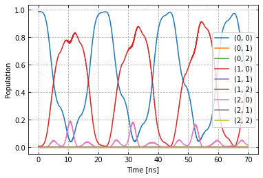

Setup of a two-qubit chip with :math:`C^3`
~~~~~~~~~~~~~~~~~~~~~~~~~~~~~~~~~~~~~~~~~~

In this example, we will set-up a two qubit quantum processor
and conduct the measurements needed to extract the relaxation time
:math:`T_1` and the dephasing time :math:`T_2^*`.

Imports
^^^^^^^

.. code:: ipython3

    # System imports
    import copy
    import numpy as np
    import time
    import itertools
    import matplotlib.pyplot as plt
    import tensorflow as tf
    import tensorflow_probability as tfp
    
    # Main C3 objects
    from c3po.c3objs import Quantity as Qty
    from c3po.experiment import Experiment as Exp
    from c3po.system.model import Model as Mdl
    from c3po.generator.generator import Generator as Gnr
    
    # Building blocks
    import c3po.generator.devices as devices
    import c3po.signal.gates as gates
    import c3po.system.chip as chip
    import c3po.signal.pulse as pulse
    import c3po.system.tasks as tasks
    
    # Libs and helpers
    import c3po.libraries.hamiltonians as hamiltonians
    import c3po.libraries.fidelities as fidelities
    import c3po.libraries.envelopes as envelopes
    import c3po.utils.qt_utils as qt_utils
    import c3po.utils.tf_utils as tf_utils

Model components
^^^^^^^^^^^^^^^^

We first create a qubit. Each parameter is a Quantity (Qty()) object
with bounds and a unit. In :math:`C^3`, the default multi-level qubit is
a Transmon modelled as a Duffing oscillator with frequency
:math:`\omega` and anharmonicity :math:`\delta` :

.. math::

    H/\hbar = \omega b^\dagger b - \frac{\delta}{2}                        \left(b^\dagger b - 1\right) b^\dagger b 

The “name” will be used to identify this qubit (or other component)
later and should thus be chosen carefully.

.. code:: ipython3

    qubit_lvls = 3
    freq_q1 = 5e9 * 2 * np.pi
    anhar_q1 = -210e6 * 2 * np.pi
    t1_q1 = 27e-6
    t2star_q1 = 39e-6
    qubit_temp = 50e-3
    
    q1 = chip.Qubit(
        name="Q1",
        desc="Qubit 1",
        freq=Qty(
            value=freq_q1,
            min=4.995e9 * 2 * np.pi,
            max=5.005e9 * 2 * np.pi,
            unit='Hz 2pi'
        ),
        anhar=Qty(
            value=anhar_q1,
            min=-380e6 * 2 * np.pi,
            max=-120e6 * 2 * np.pi,
            unit='Hz 2pi'
        ),
        hilbert_dim=qubit_lvls,
        t1=Qty(
            value=t1_q1,
            min=1e-6,
            max=90e-6,
            unit='s'
        ),
        t2star=Qty(
            value=t2star_q1,
            min=10e-6,
            max=90e-3,
            unit='s'
        ),
        temp=Qty(
            value=qubit_temp,
            min=0.0,
            max=0.12,
            unit='K'
        )
    )

And the same for a second qubit.

.. code:: ipython3

    freq_q2 = 5.6e9 * 2 * np.pi
    anhar_q2 = -240e6 * 2 * np.pi
    t1_q2 = 23e-6
    t2star_q2 = 31e-6
    q2 = chip.Qubit(
        name="Q2",
        desc="Qubit 2",
        freq=Qty(
            value=freq_q2,
            min=5.595e9 * 2 * np.pi,
            max=5.605e9 * 2 * np.pi,
            unit='Hz 2pi'
        ),
        anhar=Qty(
            value=anhar_q2,
            min=-380e6 * 2 * np.pi,
            max=-120e6 * 2 * np.pi,
            unit='Hz 2pi'
        ),
        hilbert_dim=qubit_lvls,
        t1=Qty(
            value=t1_q2,
            min=1e-6,
            max=90e-6,
            unit='s'
        ),
        t2star=Qty(
            value=t2star_q2,
            min=10e-6,
            max=90e-6,
            unit='s'
        ),
        temp=Qty(
            value=qubit_temp,
            min=0.0,
            max=0.12,
            unit='K'
        )
    )

A static coupling between the two is realized in the following way. We
supply the type of coupling by selecting int_XX
:math:`(b_1+b_1^\dagger)(b_2+b_2^\dagger)` from the hamiltonian library.
The “connected” property contains the list of qubit names to be coupled,
in this case “Q1” and “Q2”.

.. code:: ipython3

    coupling_strength = 20e6 * 2 * np.pi
    q1q2 = chip.Coupling(
        name="Q1-Q2",
        desc="coupling",
        comment="Coupling qubit 1 to qubit 2",
        connected=["Q1", "Q2"],
        strength=Qty(
            value=coupling_strength,
            min=-1 * 1e3 * 2 * np.pi,
            max=200e6 * 2 * np.pi,
            unit='Hz 2pi'
        ),
        hamiltonian_func=hamiltonians.int_XX
    )

In the same spirit, we specify control Hamiltonians to drive the system.
Again “connected” connected tells us which qubit this drive acts on and
“name” will later be used to assign the correct control signal to this
drive line.

.. code:: ipython3

    drive = chip.Drive(
        name="d1",
        desc="Drive 1",
        comment="Drive line 1 on qubit 1",
        connected=["Q1"],
        hamiltonian_func=hamiltonians.x_drive
    )
    drive2 = chip.Drive(
        name="d2",
        desc="Drive 2",
        comment="Drive line 2 on qubit 2",
        connected=["Q2"],
        hamiltonian_func=hamiltonians.x_drive
    )

In experimental practice, the qubit state can be mis-classified during
read-out. We simulate this by constructing a *confusion matrix*,
containing the probabilities for one qubit state being mistaken for
another.

.. code:: ipython3

    m00_q1 = 0.97 # Prop to read qubit 1 state 0 as 0
    m01_q1 = 0.04 # Prop to read qubit 1 state 0 as 1
    m00_q2 = 0.96 # Prop to read qubit 2 state 0 as 0
    m01_q2 = 0.05 # Prop to read qubit 2 state 0 as 1
    one_zeros = np.array([0] * qubit_lvls)
    zero_ones = np.array([1] * qubit_lvls)
    one_zeros[0] = 1
    zero_ones[0] = 0
    val1 = one_zeros * m00_q1 + zero_ones * m01_q1
    val2 = one_zeros * m00_q2 + zero_ones * m01_q2
    min = one_zeros * 0.8 + zero_ones * 0.0
    max = one_zeros * 1.0 + zero_ones * 0.2
    confusion_row1 = Qty(value=val1, min=min, max=max, unit="")
    confusion_row2 = Qty(value=val2, min=min, max=max, unit="")
    conf_matrix = tasks.ConfusionMatrix(Q1=confusion_row1, Q2=confusion_row2)

The following task creates an initial thermal state with given
temperature.

.. code:: ipython3

    init_temp = 50e-3
    init_ground = tasks.InitialiseGround(
        init_temp=Qty(
            value=init_temp,
            min=-0.001,
            max=0.22,
            unit='K'
        )
    )

We collect the parts specified above in the Model.

.. code:: ipython3

    model = Mdl(
        [q1, q2], # Individual, self-contained components
        [drive, drive2, q1q2],  # Interactions between components
        [conf_matrix, init_ground] # SPAM processing
    )

Further, we can decide between coherent or open-system dynamics using
set_lindbladian() and whether to eliminate the static coupling by going
to the dressed frame with set_dressed().

.. code:: ipython3

    model.set_lindbladian(True)
    model.set_dressed(True)

Control signals
^^^^^^^^^^^^^^^

With the system model taken care of, we now specify the control
electronics and signal chain. Complex shaped controls are often realized
by creating an envelope signal with an arbitrary waveform generator
(AWG) with limited bandwith and mixing it with a fast, stable local
oscillator (LO).

.. code:: ipython3

    sim_res = 100e9 # Resolution for numerical simulation
    awg_res = 2e9 # Realistic, limited resolution of an AWG
    lo = devices.LO(name='lo', resolution=sim_res)
    awg = devices.AWG(name='awg', resolution=awg_res)
    mixer = devices.Mixer(name='mixer')

Waveform generators exhibit a rise time, the time it takes until the
target voltage is set. This has a smoothing effect on the resulting
pulse shape.

.. code:: ipython3

    resp = devices.Response(
        name='resp',
        rise_time=Qty(
            value=0.3e-9,
            min=0.05e-9,
            max=0.6e-9,
            unit='s'
        ),
        resolution=sim_res
    )

In simulation, we translate between AWG resolution and simulation (or
“analog”) resolultion by including an up-sampling device.

.. code:: ipython3

    dig_to_an = devices.Digital_to_Analog(
        name="dac",
        resolution=sim_res
    )

Control electronics apply voltages to lines, whereas in a Hamiltonian we
usually write the control fields in energy or frequency units. In
practice, this conversion can be highly non-trivial if it involves
multiple stages of attenuation and for example the conversion of a line
voltage in an antenna to a dipole field coupling to the qubit. The
following device represents a simple, linear conversion factor.

.. code:: ipython3

    v2hz = 1e9
    v_to_hz = devices.Volts_to_Hertz(
        name='v_to_hz',
        V_to_Hz=Qty(
            value=v2hz,
            min=0.9e9,
            max=1.1e9,
            unit='Hz 2pi/V'
        )
    )

The generator combines the parts of the signal generation.

.. code:: ipython3

    generator = Gnr([lo, awg, mixer, v_to_hz, dig_to_an, resp])

Gates-set
^^^^^^^^^

It remains to write down what kind of operations we want to perform on
the device. For a gate based quantum computing chip, we define a
gate-set.

.. code:: ipython3

    gateset = gates.GateSet()

We choose a gate time and a gaussian envelope shape with a list of
parameters.

.. code:: ipython3

    t_final = 7e-9   # Time for single qubit gates
    sideband = 50e6 * 2 * np.pi
    gauss_params_single = {
        'amp': Qty(
            value=0.5,
            min=0.4,
            max=0.6,
            unit="V"
        ),
        't_final': Qty(
            value=t_final,
            min=0.5 * t_final,
            max=1.5 * t_final,
            unit="s"
        ),
        'sigma': Qty(
            value=t_final / 4,
            min=t_final / 8,
            max=t_final / 2,
            unit="s"
        ),
        'xy_angle': Qty(
            value=0.0,
            min=-0.5 * np.pi,
            max=2.5 * np.pi,
            unit='rad'
        ),
        'freq_offset': Qty(
            value=-sideband - 3e6 * 2 * np.pi,
            min=-56 * 1e6 * 2 * np.pi,
            max=-52 * 1e6 * 2 * np.pi,
            unit='Hz 2pi'
        ),
        'delta': Qty(
            value=-1,
            min=-5,
            max=3,
            unit=""
        )
    }

Here we take gaussian_nonorm() from the libraries as the function to
define the shape.

.. code:: ipython3

    gauss_env_single = pulse.Envelope(
        name="gauss",
        desc="Gaussian comp for single-qubit gates",
        params=gauss_params_single,
        shape=envelopes.gaussian_nonorm
    )

We also define a gate that represents no driving.

.. code:: ipython3

    nodrive_env = pulse.Envelope(
        name="no_drive",
        params={
            't_final': Qty(
                value=t_final,
                min=0.5 * t_final,
                max=1.5 * t_final,
                unit="s"
            )
        },
        shape=envelopes.no_drive
    )

We specify the drive tones with an offset from the qubit frequencies. As
in experiment, we will later adjust the resonance by modulating the
envelope function.

.. code:: ipython3

    lo_freq_q1 = 5e9 * 2 * np.pi + sideband
    carrier_parameters = {
        'freq': Qty(
            value=lo_freq_q1,
            min=4.5e9 * 2 * np.pi,
            max=6e9 * 2 * np.pi,
            unit='Hz 2pi'
        ),
        'framechange': Qty(
            value=0.0,
            min= -np.pi,
            max= 3 * np.pi,
            unit='rad'
        )
    }
    carr = pulse.Carrier(
        name="carrier",
        desc="Frequency of the local oscillator",
        params=carrier_parameters
    )

For the second qubit drive tone, we copy the first one and replace the
frequency. The deepcopy is to ensure that we don’t just create a pointer
to the first drive.

.. code:: ipython3

    lo_freq_q2 = 5.6e9 * 2 * np.pi + sideband
    carr_2 = copy.deepcopy(carr)
    carr_2.params['freq'].set_value(lo_freq_q2)

Instructions
^^^^^^^^^^^^

We define the gates we want to perform with a “name” that will identify
them later and “channels” relating to the control Hamiltonians and drive
lines we specified earlier. As a start we write down 90 degree rotations
in the positive :math:`x`-direction and identity gates for both qubits.
Then we add a carrier and envelope to each.

.. code:: ipython3

    X90p_q1 = gates.Instruction(
        name="X90p",
        t_start=0.0,
        t_end=t_final,
        channels=["d1"]
    )
    X90p_q2 = gates.Instruction(
        name="X90p",
        t_start=0.0,
        t_end=t_final,
        channels=["d2"]
    )
    QId_q1 = gates.Instruction(
        name="Id",
        t_start=0.0,
        t_end=t_final,
        channels=["d1"]
    )
    QId_q2 = gates.Instruction(
        name="Id",
        t_start=0.0,
        t_end=t_final,
        channels=["d2"]
    )
    
    X90p_q1.add_component(gauss_env_single, "d1")
    X90p_q1.add_component(carr, "d1")
    QId_q1.add_component(nodrive_env, "d1")
    QId_q1.add_component(copy.deepcopy(carr), "d1")
    
    X90p_q2.add_component(copy.deepcopy(gauss_env_single), "d2")
    X90p_q2.add_component(carr_2, "d2")
    QId_q2.add_component(copy.deepcopy(nodrive_env), "d2")
    QId_q2.add_component(copy.deepcopy(carr_2), "d2")

When later compiling gates into sequences, we have to take care of the
relative rotating frames of the qubits and local oscillators. We do this
by adding a phase after each gate that realigns the frames.

.. code:: ipython3

    QId_q1.comps['d1']['carrier'].params['framechange'].set_value(
        (-sideband * t_final) % (2*np.pi)
    )
    QId_q2.comps['d2']['carrier'].params['framechange'].set_value(
        (-sideband * t_final) % (2*np.pi)
    )

The remainder of the gates-set can be derived from the X90p gate by
shifting its phase by multiples of :math:`\pi/2`.

.. code:: ipython3

    Y90p_q1 = copy.deepcopy(X90p_q1)
    Y90p_q1.name = "Y90p"
    X90m_q1 = copy.deepcopy(X90p_q1)
    X90m_q1.name = "X90m"
    Y90m_q1 = copy.deepcopy(X90p_q1)
    Y90m_q1.name = "Y90m"
    Y90p_q1.comps['d1']['gauss'].params['xy_angle'].set_value(0.5 * np.pi)
    X90m_q1.comps['d1']['gauss'].params['xy_angle'].set_value(np.pi)
    Y90m_q1.comps['d1']['gauss'].params['xy_angle'].set_value(1.5 * np.pi)
    Q1_gates = [QId_q1, X90p_q1, Y90p_q1, X90m_q1, Y90m_q1]
    
    
    Y90p_q2 = copy.deepcopy(X90p_q2)
    Y90p_q2.name = "Y90p"
    X90m_q2 = copy.deepcopy(X90p_q2)
    X90m_q2.name = "X90m"
    Y90m_q2 = copy.deepcopy(X90p_q2)
    Y90m_q2.name = "Y90m"
    Y90p_q2.comps['d2']['gauss'].params['xy_angle'].set_value(0.5 * np.pi)
    X90m_q2.comps['d2']['gauss'].params['xy_angle'].set_value(np.pi)
    Y90m_q2.comps['d2']['gauss'].params['xy_angle'].set_value(1.5 * np.pi)
    Q2_gates = [QId_q2, X90p_q2, Y90p_q2, X90m_q2, Y90m_q2]

With the single qubit gates in place, we can combine them to get all
possible combinations of simultaneous gates on both qubits.

.. code:: ipython3

    all_1q_gates_comb = []
    for g1 in Q1_gates:
        for g2 in Q2_gates:
            g = gates.Instruction(
                name="NONE",
                t_start=0.0,
                t_end=t_final,
                channels=[]
            )
            g.name = g1.name + ":" + g2.name
            channels = []
            channels.extend(g1.comps.keys())
            channels.extend(g2.comps.keys())
            for chan in channels:
                g.comps[chan] = {}
                if chan in g1.comps:
                    g.comps[chan].update(g1.comps[chan])
                if chan in g2.comps:
                    g.comps[chan].update(g2.comps[chan])
            all_1q_gates_comb.append(g)
    
    for gate in all_1q_gates_comb:
        gateset.add_instruction(gate)

The experiment
^^^^^^^^^^^^^^

Finally everything is collected in the experiment that provides the
functions to interact with the system.

.. code:: ipython3

    exp = Exp(model=model, generator=generator, gateset=gateset)

Simulation
^^^^^^^^^^

With our experiment all set-up, we can perform simulations. We first
decide which basic gates to simulate, in this case only the 90 degree
rotation on one qubit and the identity.

.. code:: ipython3

    exp.opt_gates = ['X90p:Id', 'Id:Id']

The actual numerical simulation is done by calling exp.get_gates().
*WARNING:* This is resource intensive.

.. code:: ipython3

    gates = exp.get_gates()

After this step the unitaries or process matrices are stored in the exp
object. We can look at their names and matrix representations.

.. code:: ipython3

    exp.unitaries

.. parsed-literal::

    {'X90p:Id': <tf.Tensor: shape=(81, 81), dtype=complex128, numpy=
     array([[ 2.94553179e-01+7.86396861e-16j, -9.69095044e-06+2.96088647e-05j,
              3.65919712e-08-2.25282865e-07j, ...,
             -2.71397194e-08+1.63152145e-07j, -3.97082441e-08+9.99601709e-09j,
              2.33864850e-09-2.03870019e-23j],
            [ 2.91829805e-07+3.95482882e-05j,  2.94022521e-01+1.13927121e-02j,
             -7.07934527e-04-4.01777958e-04j, ...,
              1.01107927e-11+8.53656131e-11j, -2.39070377e-08+1.58267005e-07j,
              1.13197666e-08-6.21676152e-09j],
            [ 1.17105898e-08+1.96561732e-07j, -3.99692767e-04+7.84863891e-04j,
             -1.47926783e-01+2.53952958e-01j, ...,
             -1.83168288e-13+1.37483325e-11j,  2.52625255e-11+4.31469392e-10j,
             -1.22131758e-07-1.03325979e-07j],
            ...,
            [ 1.00986837e-07-8.40323400e-08j,  3.04527989e-11+1.70944456e-13j,
             -8.68087591e-12+7.79211446e-12j, ...,
             -4.67713449e-01-8.62612806e-01j, -1.15256677e-04+9.12593172e-05j,
             -6.52401314e-07-5.63238886e-07j],
            [ 7.38158682e-11-1.94943188e-10j,  9.67683304e-08-8.25374335e-08j,
              1.86498486e-10+8.49796973e-11j, ...,
             -1.13254997e-04+6.12963293e-05j, -5.30255921e-01-8.27040197e-01j,
             -7.64552458e-04-1.81377114e-03j],
            [ 3.20965082e-12-1.38234169e-25j,  3.00197373e-09+3.69314006e-09j,
              1.99649716e-08+1.25755596e-07j, ...,
              4.37838988e-07+3.98070714e-07j, -2.04122062e-03+3.29922245e-04j,
              9.82558375e-01-1.31754700e-16j]])>,
     'Id:Id': <tf.Tensor: shape=(81, 81), dtype=complex128, numpy=
     array([[ 9.99999984e-01+3.48038274e-31j, -2.47347924e-09-1.85006686e-09j,
              8.72701193e-10-9.55174948e-10j, ...,
             -5.17101153e-17-8.06639954e-16j,  2.49310277e-17+1.81336972e-16j,
              9.53493382e-16-3.38574213e-32j],
            [-2.52802358e-09+1.78327784e-09j,  9.99318750e-01+2.75411045e-02j,
              1.98157166e-07-1.56379740e-06j, ...,
              2.18862821e-16+6.74521492e-17j,  1.66044828e-16-6.32238979e-16j,
             -1.59692452e-16-5.16920186e-18j],
            [-1.26764528e-09+2.60037238e-10j, -1.42603629e-06-6.71703334e-07j,
             -5.12543954e-01+8.57435861e-01j, ...,
              2.55494803e-17+2.05359166e-17j, -1.28252019e-15-3.08520266e-15j,
              1.79829670e-15-1.32813312e-16j],
            ...,
            [-2.81216174e-17-6.47078015e-18j, -2.22871952e-18-2.64063674e-18j,
              2.64189176e-17-1.82228874e-17j, ...,
             -4.70170685e-01-8.81087302e-01j,  2.27934219e-07-2.27934629e-06j,
             -1.42476549e-09-3.32175213e-10j],
            [ 1.01262675e-18-4.78831480e-19j, -3.99362297e-17-8.24479758e-18j,
              2.45578578e-18-7.56975460e-18j, ...,
             -3.23578126e-08-1.42111496e-08j, -5.36068192e-01-8.43330056e-01j,
              3.95749033e-06-1.86402409e-06j],
            [ 3.89503694e-17-2.15964510e-33j,  2.83854840e-18+2.02045597e-18j,
             -8.54077189e-17+9.38703553e-17j, ...,
              9.64092735e-10+1.10807040e-09j,  1.80375009e-07+1.42369999e-06j,
              9.99436543e-01+1.25979563e-27j]])>}

To investigate dynamics, we define an initial state with finite
temperature we set earlier.

.. code:: ipython3

    psi_init = exp.model.tasks["init_ground"].initialise(
                    exp.model.drift_H,
                    exp.model.lindbladian
                )

Since we stored the process matrices, we can now relatively cheaply
evaluate sequences. We start with just one gate

.. code:: ipython3

    barely_a_seq = ['X90p:Id']

and plot system dynamics. The “debug” options shows the plot in this
notebook. Otherwise the plot is stored as a file in a given directory.

.. code:: ipython3

    exp.plot_dynamics(psi_init, barely_a_seq, debug=True)

.. image:: dyn_singleX.png

We can see a bad, un-optimized gate. The labels indicate qubit states in
the product basis. Next we increase the number of repetitions of the
same gate.

.. code:: ipython3

    barely_a_seq * 10

.. parsed-literal::

    ['X90p:Id',
     'X90p:Id',
     'X90p:Id',
     'X90p:Id',
     'X90p:Id',
     'X90p:Id',
     'X90p:Id',
     'X90p:Id',
     'X90p:Id',
     'X90p:Id']

.. code:: ipython3

    exp.plot_dynamics(psi_init, barely_a_seq * 5, debug=True)

.. image:: dyn_5X.png

.. code:: ipython3

    exp.plot_dynamics(psi_init, barely_a_seq * 10, debug=True)

Note that at this point, we only multiply already computed matrices. We
don’t need to solve the equations of motion again for new sequences.
